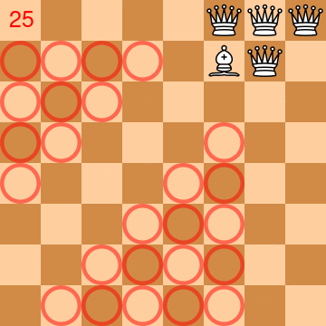
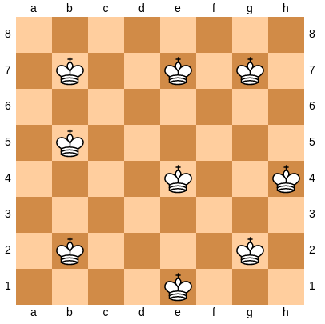

A friend posed the following puzzle/problem on social media: *"Given a 8x8 chessboard, your goal is to place 4 queens  and 1 bishop so that all squares of the board are controlled (through diagonales/lines; a piece controls the square where it is located)."* My usual reaction is to either promptly ignore this kind of fake problem or to try the resolution for real on a concrete chessboard or mentally, [sans voir](https://en.wikipedia.org/wiki/Blindfold_chess). But in this >quarantine period, I wanted to find a solution with a *program* (in next blog posts, I may explain how this attitude becomes a pattern beyond chess puzzles). Here is a short story about the process that lead to a Python solution in less than 280 characters that fits in a Tweet.

## The chess puzzle 

An animation is worth than thousands of words for explaining the problem/puzzle[^1]. The animation below almost shows a solution. 4 queens and 1 bishop are placed into a regular chess board. Circles in red represent squares that are not controlled (and yet to be controlled). The number at the top left indicates the number of squares not controlled (the goal is to reach 0). At the end of the animation, there is still missing one square ;) 




In fact, with a physical chessboard, I quickly found a solution with 63 squares (basically with some tries and errors). But the 64 graal was quite hard to achieve. Maybe there is no solution and it was a joke? I had the feeling I could succeed with a bit of time, but it would be like "déjà vu": yet another puzzle solved, what's next? Don't get me wrong, there is lot of fun and satisfaction to resolve a puzzle, but I wanted to have another kind of fun. So I decided to program a solution!   

## Programming 

[As most (?) of the programmers](https://en.wikipedia.org/wiki/Software_development_effort_estimation#Psychological_issues), I even had the impression I would be able to quickly find a solution like in a few minutes (1 hour maximum yea). After all the algorithm is quite simple: try (all) possible placements of 4 queens and 1 bishop, assess each try by counting the number of controlled squares, and stop at 64. So I launched a [Python notebook and started an implementation](https://github.com/acherm/progpuzzles/blob/master/ChessPuzzle.ipynb).  

For trying possible placements, I consider that the placement of a piece (whether it is a queen or a bishop) is a number between 0 and 63 (see [for a visual representation](https://www.chessprogramming.org/Efficient_Generation_of_Sliding_Piece_Attacks#Squares_and_Bitindex) of the board). A possible placement is a 5-tuple and the last element is the placement of the bishop. There are many possible placements and I try to generate *all*: like this, I'm sure to explore the whole space, I can compute some statistics of all solutions or eventually have a solid proof that there is no solution. There are different variants of the generation: from very naive but too computationally expensive (all possible permutations of length 5) to the exploitation of the symmetry of the chess board.   

The second task is to program a procedure that assesses whether a placement controls 64 squares. You need to compute all squares controlled by a given queen or bishop, and then make the union of all squares. So a bit of maths/algorithms and ways to represent the board/squares/pieces for computing diagonals, horizontals, verticals.

So I got some solutions (btw you can find more [statistics about all solutions of the puzzle](https://github.com/acherm/progpuzzles/blob/master/ChessPuzzle.ipynb)): 

```python
for cmb in gen_combinations():
    n = nbcases_covered(cmb)
    if (n > 63): # the solution(s)
        print(cmb, "=>", n, ntries)
        break
```

Looking back at my experience, I was a bit... puzzled ;) I was thinking it should have taken a few minutes but I was wrong, more something like 4 hours. I under-estimated the time of some tasks:

* scaling issues with combinations
* I have to remember how to properly represent a board and movements of pieces. It's not that easy and I forget also the case of squares a queen don't control because the bishop blocks the horizontal/vertical movements
* the amount of code for programming `nbcases_covered` is an indicator: not *that* straightforward

There are obviously some threats to my experience (I didn't perform the task in one shot and the quarantine at home is not a long quiet river...), but I guess similar issues arise when you program from scratch: there are many (accidental) details to deal with. 

## Opportunistic Reuse

Don't you hear the voice of *"Don't reinvent the wheel, reuse!"*? This principle applies to many cases, but reuse what? it's a chess puzzle with 4 queens and 1 bishop... Is there a chess library that supports it?

I knew [python-chess](http://python-chess.readthedocs.io/) quite well, I even implemented a chess game player on top of it, within a notebook (see my [blog post](https://blog.mathieuacher.com/JupyterChess/)). But I was thinking the library was not *designed* for tackling my problem, like: it cannot handle illegal chess positions (eg without kings!), it won't help me much (eg it's mainly a library for reading PGN game), or I will hardly generalize my solution to strange cases (eg like puzzle with 6x6 board) and I don't want to stuck on a third party library. I was wrong and missed an opportunity. 

So I decided to apply what I called *opportunistic reuse*, i.e., reusing a library that is not supposed to resolve your exact problem (who says "hack" a library). After further exploring the library, all the assumptions above collapsed:

```python
# we reuse built-in facilities of python-chess for generating moves
def nbcases_covered_reuse(cmb):
    board = chess.Board() 
    board.clear_board()
  
    for q in range(0, 4):
        board.set_piece_at(cmb[q], chess.Piece(chess.QUEEN, color=True))
    board.set_piece_at(cmb[4], chess.Piece(chess.BISHOP, color=True))  
    
    squares = []
    for q in range(0, 5):
        squares.append(cmb[q])
        squares = squares + list(board.attacks(cmb[q]))

    return len(set(squares))
```

The library does have facilities to compute the controlled squares (with the `attacks` method) and you can well give positions without kings. The method for computing the number of cases is dramatically short: I don't have to design about what is a board, a piece, a square, etc. 

Thanks to opportunistic reuse, I have now an elegant and concise solution (bonus: it's certainly better in terms of performance and testing maturity). For me, it's a lesson learned: think deeply before not considering (opportunistic) reuse. Retrospectively it is now obvious. 

## Tweetification of the solution

Now we are here, why not going further and produce an even more concise solution? The first motivation is that opportunistic reuse has already drastically reduced the amount of code, but we can do better! Secondly, chess has some nice stories with short programs (e.g., chess engine with only [760 characters C](https://en.wikipedia.org/wiki/International_Obfuscated_C_Code_Contest#Toledo_Nanochess) or that can work with [only a few bytes in memory](https://en.wikipedia.org/wiki/1K_ZX_Chess))... and I like the art of obfuscation! Thirdly, I am a big fan of incredible piece of art generated out of programs that fit in a tweet (examples: [e1](https://twitter.com/Hau_kun/status/1254709350813143040) [e2](https://twitter.com/yuruyurau/status/1254810004428750853) [e3](https://twitter.com/Hau_kun/status/1246082151017144320)); here the library [Processing](https://processing.org/) plays the role of [python-chess](http://python-chess.readthedocs.io/) and provides the facilities. 

Minification or obfuscation is well-known in programming, but here it's a bit different: you cannot fully automate the size code reduction, you need to find some tricks to simplify your code and produce the essence of it. You can also play with the specificities of programming language (here Python) to write concise code (I've learned many things about Python by doing this exercise). 

Here is the final solution:

```python
import chess as c,random as r
w=True
pk=[5,5,5,5,3]
while(w):
    s=[r.randrange(0,64) for i in range(0,5)]
    b=c.Board(fen=None)
    for q in range(0,5):b.set_piece_at(s[q],c.Piece(pk[q],w))
    if len(set()|(*[list(b.attacks(s[q]))for q in range(0,5)],s))>63:break
```

I can briefly comment:

* some shortcuts for import in such a way you can use only one letter then in the code
* `>63` takes less characters than `==64` 
* `w=True` sounds weird (`True` is soooo fundamental, why using a variable?) but is only 6 characters... the reason is that `True` is used two times: in the loop and for setting the color (the library has not default color for piece, which is something I understand but not here ;)). So it will cost eight characters... Mine uses 6+2=8. Same, so it's okay ;-) 
* for the generation of combinations, I'm using a random strategy since it's shorter in number of characters... and it might be the case that this strategy is faster to find *one* solution 
* the hack I'm the most proud is the use of an array (see `pk`), each representing a kind of piece (5 is for queen, 3 is for bishop)... it allows to call `set_piece_at` one time, thus drastically saving some characters (btw you can find older versions of my attempt in a notebook or on Twitter). This kind of trick can hardly be find by a machine (I would be *very* surprised) and, above all, it's in fact a way to *generalize* my solution: I have created an abstraction that allows one to easily modify the kind of piece we want to place 

## Generalization and beyond chess puzzles

I have generalized my solution to resolve other (who says *any*?) chess puzzles: 

* placing 3 queens in a 6x6 board in such a way all squares are controlled (you have to hack a bit to manage a 6x6 board, since the library only manages 8x8 board) 
* kings that respect social distancing  
* or the famous n-queens problem. 

Again with opportunistic reuse and in a way the program fits in a tweet ;) 

There are so many ideas to explore: the use of constraint programming, genetic algorithms, etc. If you're interested, you can [explore online the notebook and programs](https://github.com/acherm/progpuzzles/blob/master/minimality.ipynb). I highly recommend [the notebook of Luc Lesoil](https://github.com/acherm/progpuzzles/blob/master/Chess%20-%204%20queens%201%20bishop.ipynb) who nicely resolves the first chess puzzle in a different and elegant way (eg with numpy and matplotlib to visualize the solution). 

Maybe the easiest is to watch my talk [Towards programming puzzle spaces available on Youtube](https://youtu.be/oHEJJv7vUDw), given at the famous [DiverSE coffees](http://www.diverse-team.fr). In addition to what I've written in this blog post, I'm also developing and discussing the idea of *generating* interesting and enough hard puzzles (not necessary chess ones, see [examples](https://github.com/acherm/progpuzzles/blob/master/puzzlecoco.ipynb)). I'm basically arguing that whenever you see a puzzle, launch your notebook, resolve, tweetify, generalize, generate, and move to another puzzle space! 

[^1]: A chess puzzle is sometimes used to refer to a real-world chess position in which you have to find the good series of moves (e.g., checkmate in 3). It's good for training your chess skills. Here "puzzle" refers to the general term that challenges the person's ingenuity and ability to solve some problems.  

 


 


  


*(new!) I realized that some of my blog post entries are sometimes cited in academic works, so why not using the following bibtex entry?*

```bibtex
@misc{acher2020programmingchesspuzzles,
  author = {Mathieu Acher},
  title = {Programming (Chess) Puzzles with a Tweet},
  year = {2020},
  month = {apr},
  howpublished = {\url{https://blog.mathieuacher.com/ProgrammingChessPuzzles/}},
  note = {\url{https://blog.mathieuacher.com/ProgrammingChessPuzzles/}}
}
```
