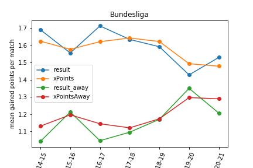
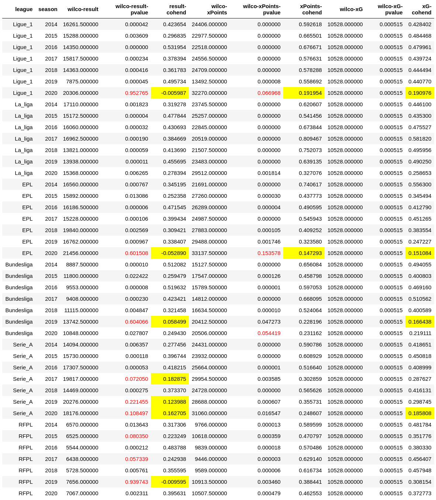

In COVID era, football matches have been played in empty stadiums. One hypothesis is that the absence of fans may call into question the way the game is played and especially the advantage of playing at home. In this post, I analyze matches' results and expected goals (xG)-like data of European leagues (Ligue 1, la Liga, Calcio, Bundesliga, Premier League, Russian championship) since 2014. Results show something happened, especially in Premier League and Ligue 1. I argue there is thus a unique opportunity to qualitatively analyze the COVID period (potentially with data obtained from computer analysis) in order to understand the new tactical or management approaches implemented. Perhaps COVID will lead to a (r)evolution of modern football?  

## Data 

I use the data coming from [understat](https://understat.com/). A unique feature of understat is that [**expected goals (xG)**](https://www.google.com/search?q=expected+goal+philosophy) are available as well as related metrics *expected goals against* (xGA) and *expected points* (xPoints). The site reports such metrics for all football matches played since 2014 and in major European leagues, namely Ligue 1 (aka french championship), la Liga, Calcio (Serie A), Bundesliga, EPL (aka Premier League), RFPL (aka russian championship). xG is a statistical measure of the quality of chances created. Intuitively, you have higher chance to score when you shot from 6 meters, in the axis than when you shot from 35 meters and you're off-center. Prediction algorithms have been applied over thousands of shots and over different parameters to compute xG. Of course, it's a metric and there is Messi: it's far from being perfect, but it is a good approximation of the quality of a team. Some people argue, and I am part of it, that xG usually gives a better indicator of the performance of a team than the raw, absolute final result. We all know football matches where a team won despite 1 chance created and 10 chances conceded. xG is particularly interesting when numerous matches are analyzed -- the miracles do not persist much on the long run. For sure, we can debate about xG for hours or days (it does not say everything about the match, the metric itself is sensitive to the quality of annotations, etc.). But let's consider in this post that xG is an interesting indicator as is final result. 

xGA is the counterpart of xG: It is a statistical measure of the quality of chances conceded. xPoints are an estimate of how many points a team can get given its xG and xGA (recall: 3 points for a win, 1 point for a draw). 

## Home advantage 

A long-standing hypothesis in football is that playing at home gives you an advantage. It's certainly true (we will verify it soon, see below) and there are several conceivable reasons why. It's out of the scope of this post, but here are possible explanations:

* (athletic reason) the presence of the fans pushes the home players to excel from a physical and determination point of view;
* (tactical reason) the presence of fans forces home players to adopt an offensive, active, riskier football while away players are more likely to undergo the game;
* (referee reason) the presence of fans impacts referee decisions;
* (spatial reason) players are familiar with the stadium, pitch, and there is no need to travel.

Are all these reasons pure bullshit and armchair philosophy? Certainly, and the list is incomplete ;) 
In this post, we are interested in determining whether home advantage is a thing. In case it is you have reasons to have endless debate about why. In case not, you can also have endless debates. 
Specifically, football matches have been played in empty stadiums in COVID era. It's an unique opportunity to investigate whether the COVID has had an effect on home advantage; and to *compare* this COVID situation to traditional seasons.   

## Home advantage? 

We can first wonder how final results and xPoints related to home advantage in non-COVID seasons (2014, 2015, 2016, 2017, 2018).  

Table below shows that the difference between points gained at home and away is largely positive, for all leagues and non-COVID seasons (see column DIFF_POINTS_HOMEAWAY). For instance, in 2014 and in Ligue 1, 210 more points were earned at home. The same trend can be observed for expected points (xPoints). For instance, in La Liga, 201 more expected points were earned at home in 2014. 

Though there are some fluctuations across seasons for actual points (eg Ligue 1 in 2015 vs 2016), there is a clear positive effect of playing home in all leagues. Expected points may provide other insights for some leagues and seasons (eg xPoints for Ligue 1 are comparatively more stable than actual gained points), but confirm the observations.  

What is worth noticing is this sudden drop in 2020 or in 2019 for some leagues (Bundesliga, Russia). It corresponds to the COVID period where stadiums were empty. In detail, french league simply stopped the 2019-2020 season mid-march 2020 whereas Bundesliga played again around mi-May 2020 in order to finish 2019-2020 season. 

**In 2020, a surprising reversal occurred in Ligue 1 and Premier League: more points were scored away than at home!** 

Looking at actual points, in Russia championship and in 2019, there was also this effect. Bundesliga in 2019 suggested a trend, but on fewer games. In general, 2019 is hard to analyze since it's a mix of COVID and non COVID period. Serie A and Liga were apparently less impacted. 

Now looking at expected points, the reversal for Ligue 1 and Premier League is less strong (61 xPoints for Ligue 1, 48 xPoints for Premier League). However there is a comparable decrease. 

 

The table with bar charts was here to visualize and investigate a possible effect of COVID on home advantage. Another perspective is given in the plots below. For each league, I plot the evolution of mean gained points (per match) for all seasons from 2014 to 2020. For non-COVID period, there was a difference between result and result_away (actual gained points at home and away). There was also a difference between xPoints and xPoints away. However, we can see that in Ligue 1 and Premier League (EPL) points won at home *matched* the points won away for season 2020-2021. It is a surprising evolution! 

**The expected points won at home vs away temper a bit the situation for Ligue 1 and EPL, but still show a decrease of home advantage. In fact, even La Liga, Bundesliga, and Serie A have been impacted when looking at xPoints vs xPoints away.**  

  

  

 

  

  

  

## Really? 

Differences in table and plots are good to give intuition, but let's do some statistical tests. Intuitively, the observations for COVID-like seasons might be due to "luck" and randomness (eg there were more victories away but it's due to coincidence or low number of matches). I used the non-parametrical Wilcoxon Signed-Rank test to assess differences between home and away matches, considering either actual result, xPoints, or xG. 

Table below reports results for each season and each league. In detail, "wilco-result-pvalues" is the p-value of Wilcoxon Signed-Rank over actual results at home and actual results away. "wilco-xPoints-pvalues"  is the p-value of  Wilcoxon Signed-Rank over xPoints at home and xPoints away. In general, p-values < 0.05 is considered to reject the null hypothesis (eg in our case that actual results at home come from the same distributions as actual results away). I highlight such values in red. In concrete terms, red values mean we can hardly distinguish home results from away results: the advantage of playing home is not!  

For effect size, I also report Cohen's d (difference between two means divided by a standard deviation) for both actual points, xPoints, and xG. The reading grid is as follows: small < 0.20 (highlighted in yellow), 0.20 <= medium < 0.50, 0.5 <= large < 0.8. 

Statistical results show that the COVID period had variable effect:

* **in Ligue 1 and EPL, the advantage of playing home is seriously questioned even when considering xPoints**; 
* Bundesliga has been impacted for the hybrid 2019 season (in terms of actual results, but not in terms of xPoints) and in 2020 season when looking at xPoints (not actual results)
* Serie A has been impacted as well if we consider actual results, but looking at xPoints the COVID has little effect. By the way, the 2017 season (non COVID period) is different, but mostly due to the gap between xPoints and actual results.  
* **La Liga seems not impacted at all (home advantage is still a thing)**
* Russia has been impacted in 2019 (but not looking at xPoints), but 2020 leads to a quite normal situation
  

  

## Really?! 

Up to now, I did not consider the evolution of home advantage *within* a league. For instance, La liga's results suggest that playing home is still an advantage in Spain, but previous plots/tables suggest that the advantage is actually less important than in non-COVID periods. 

I used the non-parametrical Mann–Whitney U test to assess differences between seasons (in terms of actual results home and xPoints home). I did the test for each pair of season: for example, 2020 with 2014, with 2020 with 2015, but also 2016 with 2017, etc. The idea is to compare COVID season with non-COVID season. I highlight in red p-value < 0.05 and report only for xPoints (you know my preferences). 

**Statistical results over xPoints show that the COVID has impacted the usual and relative home advantage within all leagues (except Russia)** . For Ligue 1 and EPL, it's more a confirmation of previous results (but under a different perspective): playing home is less an advantage per se, but it also questions the trend of previous seasons. *Liga is this time time impacted:* 2020 has comparatively to other seasons decreased the advantage of playing home. Hence, playing home remains the advantage, but this advantaged is partly mitigated. Russia is not impacted (it's in line with previous results on xPoints). Bundesliga had a rather strange 2015 season, but the COVID period (2019 and 2020) is a thing. Finally, Calcio is little impacted. 

  
  

As a side note, I found the comparison across seasons to be more delicate and subject to caution. First, the set of teams varies across seasons. Second, the teams themselves change with different players and clubs.   

## Future work

Results show that something happened, especially in Premier League and Ligue 1. I have also compiled other results about individual clubs' evolutions with and without COVID, but I found them hard to interpret as clubs are capable of changing the whole team and the coach in a few months. 

There are many threats to my analysis and it should really be read as an exercise on my side. This post has not been peer-reviewed: don't hesitate to correct me or suggest improvements! Threats include: 

* statistical tests: I've used non-parametric tests owing to the sample size and distribution, but other tests may reveal other insights or results. Some indicators like Cohen's d should be interpreted with caution; 
* the metrics I've chosen (xG, xGA, xPoints, and actual results) have limitations but are available for 6 leagues and since 2014. Other indicators can be used, but might not available for all leagues and seasons; 
* randomness: statistical tests are here to mitigate randomness in the repetition of matches (says), but randomness is also present in the pitch, in the referee decisions, or even in how data about xG has been annotated;
* I can certainly do a better job when distinguishing COVID and non-COVID periods... for instance, Bundesliga and Calcio continued the 2019-2020 season in empty stadiums. Instead, I've considered the whole 2019-2020 season as a COVID season: it's obviously a threat!   
* sometimes stadiums are empty not because of COVID but because of political decisions... it happened a lot in France for example: I've not made the effort to annotate/forget such matches.  

This exercise left me thinking about other questions that remain unanswered and that would deserve a future treatment:

* What are the results for other leagues? For instance, in South America (says Brazil and Argentina): is it the same trend? In amateur football, is home an advantage as in professional football? Here we do not have data about COVID (competitions simply stop) but I'm now wondering what is the result even in non-COVID situations. Women's football is also an interesting case, in COVID and non-COVID situations. 
* How to explain the drop of home advantage in COVID era for Ligue 1 and Premier League (mainly)? It's a key question raised by the quantitative analysis I made. In fact, it's also interesting to look at other championships: why La Liga has succeeded to keep home advantage, despite empty stadiums? 

In fact, my original motivation was to verify that COVID has had an effect. It was both my intuition and my hope ;) Because now we know something happened, there is a unique opportunity to understand *why* and *what* fundamentally changes in the way football is played. In particular, a qualitative analysis of the COVID period is more than welcome. For instance, do tactical approaches have changed? It is quite difficult to answer this question since it would require to accurately review thousands of matches. However, the rise of data and artificial intelligence can help to understand them at scale. From this perspective, the [ongoing effort of Deep Mind with Liverpool is worth looking at](https://arxiv.org/abs/2011.09192). The idea of using computer visions to synthesize data out of COVID matches (potentially much more insightful than xG) can show some new patterns, new strategies or management approaches. Perhaps, incidentally, COVID will lead to a (r)evolution of modern football. At least, it will be for sure an opportunity.   

 

 

