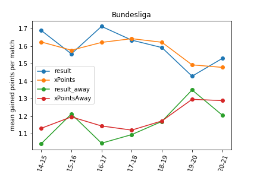
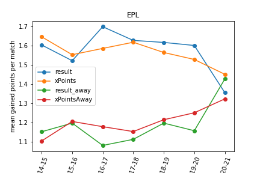

In COVID era, football matches have been played in empty stadiums. One hypothesis is that the absence of fans may call into question the way the game is played and especially the advantage of playing at home. In this post, I analyze matches' results and expected goals (xG)-like data of European leagues (Ligue 1, la Liga, Calcio, Bundesliga, Premier League, Russian championship) since 2014. Results show something happened, especially in Premier League and Ligue 1. I argue there is thus a unique opportunity to qualitatively analyze the COVID period (potentially with data obtained from computer analysis) in order to understand the new tactical or management approaches implemented. Perhaps COVID will lead to a (r)evolution of modern football?  

## Data 

I use the data coming from [understat](https://understat.com/). A unique feature of understat is that **expected goals (xG)** are available as well as related metrics *expected goals against* (xGA) and *expected points* (xPoints). The site reports such metrics for all football matches played since 2014 and in major European leagues, namely Ligue 1 (aka french championship), la Liga, Calcio, Bundesliga, EPL (aka Premier League), RFPL (aka russian championship). xG is a statistical measure of the quality of chances created and conceded. Intuitively, you have higher chance to score when you shot from 6 meters, in the axis than when you shot from 35 meters and you're off-center. Prediction algorithms have been applied over thousands of shots and over different parameters to compute xG. Of course, it's a metric and there is Messi: it's far from being perfect, but it is a good approximation of the quality of a team. Some people argue, and I am part of it, that xG usually gives a better indicator of the performance of a team than the raw, absolute final result. We all know football matches where a team won despite 1 chance created and 10 chances conceded. xG is particularly interesting when numerous matches are analyzed -- the miracles do not persist much on the long run. For sure, we can debate about xG for hours or days (it does not say everything about the match, the metric itself is sensitive to the quality of annotations, etc.). But let's consider in this post that xG is an interesting indicator as is final result. 

xGA is the counterpart of xG: It is a statistical measure of the quality of chances conceded. xPoints are an estimate of how many points a team can get given its xG and xGA (recall: 3 points for a win, 1 point for a draw). 

## Home advantage 

A long-standing hypothesis in football is that playing at home gives you an advantage. It's certainly true (we will verify it soon, see below) and there are several conceivable reasons why. It's out of the scope of this post, but here are possible explanations:

* (athletic reason) the presence of the fans pushes the home players to excel from a physical and determination point of view

* (tactical reason) the presence of fans forces home players to adopt an offensive, active, riskier football while away players are more likely to undergo the game
* (referee reason) the presence of fans impacts referee decisions
* (spatial reason) players are familiar with the stadium, pitch, and there is no need to travel

Are all these reasons pure bullshit and armchair philosophy? Certainly, and the list is incomplete ;) 

In this post, we are interested in determining whether home advantage is a thing. In case it is you have reasons to have endless debate about why. In case not, you can also have endless debate. 

Specifically, football matches have been played in empty stadiums in COVID era. It's an unique opportunity to investigate whether the COVID has had an effect on home advantage; and to *compare* this COVID situation to traditional seasons.  

 

## Home advantage? 

We can first wonder how final results, xG, xGA, and xPoints related to home advantage in non-COVID seasons (2014, 2015, 2016, 2017, 2018).  



| league     |   year |   diff_points_home_away |\n|:-----------|-------:|------------------------:|\n| Ligue_1    |   2014 |                     210 |\n| Ligue_1    |   2015 |                     144 |\n| Ligue_1    |   2016 |                     258 |\n| Ligue_1    |   2017 |                     186 |\n| Ligue_1    |   2018 |                     174 |\n| Ligue_1    |   2019 |                     177 |\n| Ligue_1    |   2020 |                      -3 |\n| La_liga    |   2014 |                     159 |\n| La_liga    |   2015 |                     234 |\n| La_liga    |   2016 |                     213 |\n| La_liga    |   2017 |                     192 |\n| La_liga    |   2018 |                     198 |\n| La_liga    |   2019 |                     219 |\n| La_liga    |   2020 |                     135 |\n| EPL        |   2014 |                     171 |\n| EPL        |   2015 |                     123 |\n| EPL        |   2016 |                     234 |\n| EPL        |   2017 |                     195 |\n| EPL        |   2018 |                     159 |\n| EPL        |   2019 |                     168 |\n| EPL        |   2020 |                     -27 |\n| Bundesliga |   2014 |                     198 |\n| Bundesliga |   2015 |                     105 |\n| Bundesliga |   2016 |                     204 |\n| Bundesliga |   2017 |                     165 |\n| Bundesliga |   2018 |                     129 |\n| Bundesliga |   2019 |                      24 |\n| Bundesliga |   2020 |                      99 |\n| Serie_A    |   2014 |                     132 |\n| Serie_A    |   2015 |                     195 |\n| Serie_A    |   2016 |                     210 |\n| Serie_A    |   2017 |                      93 |\n| Serie_A    |   2018 |                     180 |\n| Serie_A    |   2019 |                      63 |\n| Serie_A    |   2020 |                      81 |\n| RFPL       |   2014 |                      99 |\n| RFPL       |   2015 |                      69 |\n| RFPL       |   2016 |                     147 |\n| RFPL       |   2017 |                      75 |\n| RFPL       |   2018 |                     108 |\n| RFPL       |   2019 |                      -3 |\n| RFPL       |   2020 |                     126 |

  

    

## Really? 

## Future work

* xG, xGA, xPoints are possible metrics, but other indicators can be used 
* What are the results for other ligues? For instance, in South America (says Brazil and Argentina): is it the same trend? In amateur football, is home an advantage as in professional football? Here we do not have data about COVID (competitions simply stop) but I'm now wondering what is the result even in non-COVID situations. Women's football is also an interesting case, in COVID and non-COVID situations. 
* How to explain the drop of home advantage in COVID era for Ligue 1 and Premier League (mainly)? It's a key question raised by the quantitative analysis. In fact, it's also interesting to look at championships where almost nothing happen: why La Liga has been so stable? 

 

 

