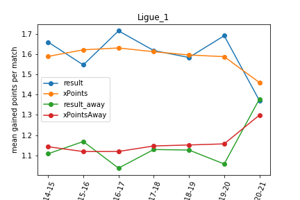

In COVID era, football matches have been played in empty stadiums. One hypothesis is that the absence of fans may call into question the way the game is played and especially the advantage of playing at home. In this post, I analyze matches' results and expected goals (xG)-like data of European leagues (Ligue 1, la Liga, Calcio, Bundesliga, Premier League, Russian championship) since 2014. Results show something happened, especially in Premier League and Ligue 1. I argue there is thus a unique opportunity to qualitatively analyze the COVID period (potentially with data obtained from computer analysis) in order to understand the new tactical or management approaches implemented. Perhaps COVID will lead to a (r)evolution of modern football?  

## Data 

I use the data coming from [understat](https://understat.com/). A unique feature of understat is that **expected goals (xG)** are available as well as related metrics *expected goals against* (xGA) and *expected points* (xPoints). The site reports such metrics for all football matches played since 2014 and in major European leagues, namely Ligue 1 (aka french championship), la Liga, Calcio, Bundesliga, EPL (aka Premier League), RFPL (aka russian championship). xG is a statistical measure of the quality of chances created and conceded. Intuitively, you have higher chance to score when you shot from 6 meters, in the axis than when you shot from 35 meters and you're off-center. Prediction algorithms have been applied over thousands of shots and over different parameters to compute xG. Of course, it's a metric and there is Messi: it's far from being perfect, but it is a good approximation of the quality of a team. Some people argue, and I am part of it, that xG usually gives a better indicator of the performance of a team than the raw, absolute final result. We all know football matches where a team won despite 1 chance created and 10 chances conceded. xG is particularly interesting when numerous matches are analyzed -- the miracles do not persist much on the long run. For sure, we can debate about xG for hours or days (it does not say everything about the match, the metric itself is sensitive to the quality of annotations, etc.). But let's consider in this post that xG is an interesting indicator as is final result. 

xGA is the counterpart of xG: It is a statistical measure of the quality of chances conceded. xPoints are an estimate of how many points a team can get given its xG and xGA (recall: 3 points for a win, 1 point for a draw). 

## Home advantage 

A long-standing hypothesis in football is that playing at home gives you an advantage. It's certainly true (we will verify it soon, see below) and there are several conceivable reasons why. It's out of the scope of this post, but here are possible explanations:

* (athletic reason) the presence of the fans pushes the home players to excel from a physical and determination point of view

* (tactical reason) the presence of fans forces home players to adopt an offensive, active, riskier football while away players are more likely to undergo the game
* (referee reason) the presence of fans impacts referee decisions
* (spatial reason) players are familiar with the stadium, pitch, and there is no need to travel

Are all these reasons pure bullshit and armchair philosophy? Certainly, and the list is incomplete ;) 

In this post, we are interested in determining whether home advantage is a thing. In case it is you have reasons to have endless debate about why. In case not, you can also have endless debate. 

Specifically, football matches have been played in empty stadiums in COVID era. It's an unique opportunity to investigate whether the COVID has had an effect on home advantage; and to *compare* this COVID situation to traditional seasons.  

 

## Home advantage? 

We can first wonder how final results, xG, xGA, and xPoints related to home advantage in non-COVID seasons (2014, 2015, 2016, 2017, 2018).  

<table id="T_908b5_" ><thead>    <tr>        <th class="blank level0" ></th>        <th class="col_heading level0 col0" >league</th>        <th class="col_heading level0 col1" >year</th>        <th class="col_heading level0 col2" >diff_points_home_away</th>    </tr></thead><tbody>\n                <tr>\n                        <th id="T_908b5_level0_row0" class="row_heading level0 row0" >0</th>\n                        <td id="T_908b5_row0_col0" class="data row0 col0" >Ligue_1</td>\n                        <td id="T_908b5_row0_col1" class="data row0 col1" >2014</td>\n                        <td id="T_908b5_row0_col2" class="data row0 col2" >210</td>\n            </tr>\n            <tr>\n                        <th id="T_908b5_level0_row1" class="row_heading level0 row1" >1</th>\n                        <td id="T_908b5_row1_col0" class="data row1 col0" >Ligue_1</td>\n                        <td id="T_908b5_row1_col1" class="data row1 col1" >2015</td>\n                        <td id="T_908b5_row1_col2" class="data row1 col2" >144</td>\n            </tr>\n            <tr>\n                        <th id="T_908b5_level0_row2" class="row_heading level0 row2" >2</th>\n                        <td id="T_908b5_row2_col0" class="data row2 col0" >Ligue_1</td>\n                        <td id="T_908b5_row2_col1" class="data row2 col1" >2016</td>\n                        <td id="T_908b5_row2_col2" class="data row2 col2" >258</td>\n            </tr>\n            <tr>\n                        <th id="T_908b5_level0_row3" class="row_heading level0 row3" >3</th>\n                        <td id="T_908b5_row3_col0" class="data row3 col0" >Ligue_1</td>\n                        <td id="T_908b5_row3_col1" class="data row3 col1" >2017</td>\n                        <td id="T_908b5_row3_col2" class="data row3 col2" >186</td>\n            </tr>\n            <tr>\n                        <th id="T_908b5_level0_row4" class="row_heading level0 row4" >4</th>\n                        <td id="T_908b5_row4_col0" class="data row4 col0" >Ligue_1</td>\n                        <td id="T_908b5_row4_col1" class="data row4 col1" >2018</td>\n                        <td id="T_908b5_row4_col2" class="data row4 col2" >174</td>\n            </tr>\n            <tr>\n                        <th id="T_908b5_level0_row5" class="row_heading level0 row5" >5</th>\n                        <td id="T_908b5_row5_col0" class="data row5 col0" >Ligue_1</td>\n                        <td id="T_908b5_row5_col1" class="data row5 col1" >2019</td>\n                        <td id="T_908b5_row5_col2" class="data row5 col2" >177</td>\n            </tr>\n            <tr>\n                        <th id="T_908b5_level0_row6" class="row_heading level0 row6" >6</th>\n                        <td id="T_908b5_row6_col0" class="data row6 col0" >Ligue_1</td>\n                        <td id="T_908b5_row6_col1" class="data row6 col1" >2020</td>\n                        <td id="T_908b5_row6_col2" class="data row6 col2" >-3</td>\n            </tr>\n            <tr>\n                        <th id="T_908b5_level0_row7" class="row_heading level0 row7" >7</th>\n                        <td id="T_908b5_row7_col0" class="data row7 col0" >La_liga</td>\n                        <td id="T_908b5_row7_col1" class="data row7 col1" >2014</td>\n                        <td id="T_908b5_row7_col2" class="data row7 col2" >159</td>\n            </tr>\n            <tr>\n                        <th id="T_908b5_level0_row8" class="row_heading level0 row8" >8</th>\n                        <td id="T_908b5_row8_col0" class="data row8 col0" >La_liga</td>\n                        <td id="T_908b5_row8_col1" class="data row8 col1" >2015</td>\n                        <td id="T_908b5_row8_col2" class="data row8 col2" >234</td>\n            </tr>\n            <tr>\n                        <th id="T_908b5_level0_row9" class="row_heading level0 row9" >9</th>\n                        <td id="T_908b5_row9_col0" class="data row9 col0" >La_liga</td>\n                        <td id="T_908b5_row9_col1" class="data row9 col1" >2016</td>\n                        <td id="T_908b5_row9_col2" class="data row9 col2" >213</td>\n            </tr>\n            <tr>\n                        <th id="T_908b5_level0_row10" class="row_heading level0 row10" >10</th>\n                        <td id="T_908b5_row10_col0" class="data row10 col0" >La_liga</td>\n                        <td id="T_908b5_row10_col1" class="data row10 col1" >2017</td>\n                        <td id="T_908b5_row10_col2" class="data row10 col2" >192</td>\n            </tr>\n            <tr>\n                        <th id="T_908b5_level0_row11" class="row_heading level0 row11" >11</th>\n                        <td id="T_908b5_row11_col0" class="data row11 col0" >La_liga</td>\n                        <td id="T_908b5_row11_col1" class="data row11 col1" >2018</td>\n                        <td id="T_908b5_row11_col2" class="data row11 col2" >198</td>\n            </tr>\n            <tr>\n                        <th id="T_908b5_level0_row12" class="row_heading level0 row12" >12</th>\n                        <td id="T_908b5_row12_col0" class="data row12 col0" >La_liga</td>\n                        <td id="T_908b5_row12_col1" class="data row12 col1" >2019</td>\n                        <td id="T_908b5_row12_col2" class="data row12 col2" >219</td>\n            </tr>\n            <tr>\n                        <th id="T_908b5_level0_row13" class="row_heading level0 row13" >13</th>\n                        <td id="T_908b5_row13_col0" class="data row13 col0" >La_liga</td>\n                        <td id="T_908b5_row13_col1" class="data row13 col1" >2020</td>\n                        <td id="T_908b5_row13_col2" class="data row13 col2" >135</td>\n            </tr>\n            <tr>\n                        <th id="T_908b5_level0_row14" class="row_heading level0 row14" >14</th>\n                        <td id="T_908b5_row14_col0" class="data row14 col0" >EPL</td>\n                        <td id="T_908b5_row14_col1" class="data row14 col1" >2014</td>\n                        <td id="T_908b5_row14_col2" class="data row14 col2" >171</td>\n            </tr>\n            <tr>\n                        <th id="T_908b5_level0_row15" class="row_heading level0 row15" >15</th>\n                        <td id="T_908b5_row15_col0" class="data row15 col0" >EPL</td>\n                        <td id="T_908b5_row15_col1" class="data row15 col1" >2015</td>\n                        <td id="T_908b5_row15_col2" class="data row15 col2" >123</td>\n            </tr>\n            <tr>\n                        <th id="T_908b5_level0_row16" class="row_heading level0 row16" >16</th>\n                        <td id="T_908b5_row16_col0" class="data row16 col0" >EPL</td>\n                        <td id="T_908b5_row16_col1" class="data row16 col1" >2016</td>\n                        <td id="T_908b5_row16_col2" class="data row16 col2" >234</td>\n            </tr>\n            <tr>\n                        <th id="T_908b5_level0_row17" class="row_heading level0 row17" >17</th>\n                        <td id="T_908b5_row17_col0" class="data row17 col0" >EPL</td>\n                        <td id="T_908b5_row17_col1" class="data row17 col1" >2017</td>\n                        <td id="T_908b5_row17_col2" class="data row17 col2" >195</td>\n            </tr>\n            <tr>\n                        <th id="T_908b5_level0_row18" class="row_heading level0 row18" >18</th>\n                        <td id="T_908b5_row18_col0" class="data row18 col0" >EPL</td>\n                        <td id="T_908b5_row18_col1" class="data row18 col1" >2018</td>\n                        <td id="T_908b5_row18_col2" class="data row18 col2" >159</td>\n            </tr>\n            <tr>\n                        <th id="T_908b5_level0_row19" class="row_heading level0 row19" >19</th>\n                        <td id="T_908b5_row19_col0" class="data row19 col0" >EPL</td>\n                        <td id="T_908b5_row19_col1" class="data row19 col1" >2019</td>\n                        <td id="T_908b5_row19_col2" class="data row19 col2" >168</td>\n            </tr>\n            <tr>\n                        <th id="T_908b5_level0_row20" class="row_heading level0 row20" >20</th>\n                        <td id="T_908b5_row20_col0" class="data row20 col0" >EPL</td>\n                        <td id="T_908b5_row20_col1" class="data row20 col1" >2020</td>\n                        <td id="T_908b5_row20_col2" class="data row20 col2" >-27</td>\n            </tr>\n            <tr>\n                        <th id="T_908b5_level0_row21" class="row_heading level0 row21" >21</th>\n                        <td id="T_908b5_row21_col0" class="data row21 col0" >Bundesliga</td>\n                        <td id="T_908b5_row21_col1" class="data row21 col1" >2014</td>\n                        <td id="T_908b5_row21_col2" class="data row21 col2" >198</td>\n            </tr>\n            <tr>\n                        <th id="T_908b5_level0_row22" class="row_heading level0 row22" >22</th>\n                        <td id="T_908b5_row22_col0" class="data row22 col0" >Bundesliga</td>\n                        <td id="T_908b5_row22_col1" class="data row22 col1" >2015</td>\n                        <td id="T_908b5_row22_col2" class="data row22 col2" >105</td>\n            </tr>\n            <tr>\n                        <th id="T_908b5_level0_row23" class="row_heading level0 row23" >23</th>\n                        <td id="T_908b5_row23_col0" class="data row23 col0" >Bundesliga</td>\n                        <td id="T_908b5_row23_col1" class="data row23 col1" >2016</td>\n                        <td id="T_908b5_row23_col2" class="data row23 col2" >204</td>\n            </tr>\n            <tr>\n                        <th id="T_908b5_level0_row24" class="row_heading level0 row24" >24</th>\n                        <td id="T_908b5_row24_col0" class="data row24 col0" >Bundesliga</td>\n                        <td id="T_908b5_row24_col1" class="data row24 col1" >2017</td>\n                        <td id="T_908b5_row24_col2" class="data row24 col2" >165</td>\n            </tr>\n            <tr>\n                        <th id="T_908b5_level0_row25" class="row_heading level0 row25" >25</th>\n                        <td id="T_908b5_row25_col0" class="data row25 col0" >Bundesliga</td>\n                        <td id="T_908b5_row25_col1" class="data row25 col1" >2018</td>\n                        <td id="T_908b5_row25_col2" class="data row25 col2" >129</td>\n            </tr>\n            <tr>\n                        <th id="T_908b5_level0_row26" class="row_heading level0 row26" >26</th>\n                        <td id="T_908b5_row26_col0" class="data row26 col0" >Bundesliga</td>\n                        <td id="T_908b5_row26_col1" class="data row26 col1" >2019</td>\n                        <td id="T_908b5_row26_col2" class="data row26 col2" >24</td>\n            </tr>\n            <tr>\n                        <th id="T_908b5_level0_row27" class="row_heading level0 row27" >27</th>\n                        <td id="T_908b5_row27_col0" class="data row27 col0" >Bundesliga</td>\n                        <td id="T_908b5_row27_col1" class="data row27 col1" >2020</td>\n                        <td id="T_908b5_row27_col2" class="data row27 col2" >99</td>\n            </tr>\n            <tr>\n                        <th id="T_908b5_level0_row28" class="row_heading level0 row28" >28</th>\n                        <td id="T_908b5_row28_col0" class="data row28 col0" >Serie_A</td>\n                        <td id="T_908b5_row28_col1" class="data row28 col1" >2014</td>\n                        <td id="T_908b5_row28_col2" class="data row28 col2" >132</td>\n            </tr>\n            <tr>\n                        <th id="T_908b5_level0_row29" class="row_heading level0 row29" >29</th>\n                        <td id="T_908b5_row29_col0" class="data row29 col0" >Serie_A</td>\n                        <td id="T_908b5_row29_col1" class="data row29 col1" >2015</td>\n                        <td id="T_908b5_row29_col2" class="data row29 col2" >195</td>\n            </tr>\n            <tr>\n                        <th id="T_908b5_level0_row30" class="row_heading level0 row30" >30</th>\n                        <td id="T_908b5_row30_col0" class="data row30 col0" >Serie_A</td>\n                        <td id="T_908b5_row30_col1" class="data row30 col1" >2016</td>\n                        <td id="T_908b5_row30_col2" class="data row30 col2" >210</td>\n            </tr>\n            <tr>\n                        <th id="T_908b5_level0_row31" class="row_heading level0 row31" >31</th>\n                        <td id="T_908b5_row31_col0" class="data row31 col0" >Serie_A</td>\n                        <td id="T_908b5_row31_col1" class="data row31 col1" >2017</td>\n                        <td id="T_908b5_row31_col2" class="data row31 col2" >93</td>\n            </tr>\n            <tr>\n                        <th id="T_908b5_level0_row32" class="row_heading level0 row32" >32</th>\n                        <td id="T_908b5_row32_col0" class="data row32 col0" >Serie_A</td>\n                        <td id="T_908b5_row32_col1" class="data row32 col1" >2018</td>\n                        <td id="T_908b5_row32_col2" class="data row32 col2" >180</td>\n            </tr>\n            <tr>\n                        <th id="T_908b5_level0_row33" class="row_heading level0 row33" >33</th>\n                        <td id="T_908b5_row33_col0" class="data row33 col0" >Serie_A</td>\n                        <td id="T_908b5_row33_col1" class="data row33 col1" >2019</td>\n                        <td id="T_908b5_row33_col2" class="data row33 col2" >63</td>\n            </tr>\n            <tr>\n                        <th id="T_908b5_level0_row34" class="row_heading level0 row34" >34</th>\n                        <td id="T_908b5_row34_col0" class="data row34 col0" >Serie_A</td>\n                        <td id="T_908b5_row34_col1" class="data row34 col1" >2020</td>\n                        <td id="T_908b5_row34_col2" class="data row34 col2" >81</td>\n            </tr>\n            <tr>\n                        <th id="T_908b5_level0_row35" class="row_heading level0 row35" >35</th>\n                        <td id="T_908b5_row35_col0" class="data row35 col0" >RFPL</td>\n                        <td id="T_908b5_row35_col1" class="data row35 col1" >2014</td>\n                        <td id="T_908b5_row35_col2" class="data row35 col2" >99</td>\n            </tr>\n            <tr>\n                        <th id="T_908b5_level0_row36" class="row_heading level0 row36" >36</th>\n                        <td id="T_908b5_row36_col0" class="data row36 col0" >RFPL</td>\n                        <td id="T_908b5_row36_col1" class="data row36 col1" >2015</td>\n                        <td id="T_908b5_row36_col2" class="data row36 col2" >69</td>\n            </tr>\n            <tr>\n                        <th id="T_908b5_level0_row37" class="row_heading level0 row37" >37</th>\n                        <td id="T_908b5_row37_col0" class="data row37 col0" >RFPL</td>\n                        <td id="T_908b5_row37_col1" class="data row37 col1" >2016</td>\n                        <td id="T_908b5_row37_col2" class="data row37 col2" >147</td>\n            </tr>\n            <tr>\n                        <th id="T_908b5_level0_row38" class="row_heading level0 row38" >38</th>\n                        <td id="T_908b5_row38_col0" class="data row38 col0" >RFPL</td>\n                        <td id="T_908b5_row38_col1" class="data row38 col1" >2017</td>\n                        <td id="T_908b5_row38_col2" class="data row38 col2" >75</td>\n            </tr>\n            <tr>\n                        <th id="T_908b5_level0_row39" class="row_heading level0 row39" >39</th>\n                        <td id="T_908b5_row39_col0" class="data row39 col0" >RFPL</td>\n                        <td id="T_908b5_row39_col1" class="data row39 col1" >2018</td>\n                        <td id="T_908b5_row39_col2" class="data row39 col2" >108</td>\n            </tr>\n            <tr>\n                        <th id="T_908b5_level0_row40" class="row_heading level0 row40" >40</th>\n                        <td id="T_908b5_row40_col0" class="data row40 col0" >RFPL</td>\n                        <td id="T_908b5_row40_col1" class="data row40 col1" >2019</td>\n                        <td id="T_908b5_row40_col2" class="data row40 col2" >-3</td>\n            </tr>\n            <tr>\n                        <th id="T_908b5_level0_row41" class="row_heading level0 row41" >41</th>\n                        <td id="T_908b5_row41_col0" class="data row41 col0" >RFPL</td>\n                        <td id="T_908b5_row41_col1" class="data row41 col1" >2020</td>\n                        <td id="T_908b5_row41_col2" class="data row41 col2" >126</td>\n            </tr>\n    </tbody></table>

  

    

## Really? 

## Future work

* xG, xGA, xPoints are possible metrics, but other indicators can be used 
* What are the results for other ligues? For instance, in South America (says Brazil and Argentina): is it the same trend? In amateur football, is home an advantage as in professional football? Here we do not have data about COVID (competitions simply stop) but I'm now wondering what is the result even in non-COVID situations. Women's football is also an interesting case, in COVID and non-COVID situations. 
* How to explain the drop of home advantage in COVID era for Ligue 1 and Premier League (mainly)? It's a key question raised by the quantitative analysis. In fact, it's also interesting to look at championships where almost nothing happen: why La Liga has been so stable? 

 

 

