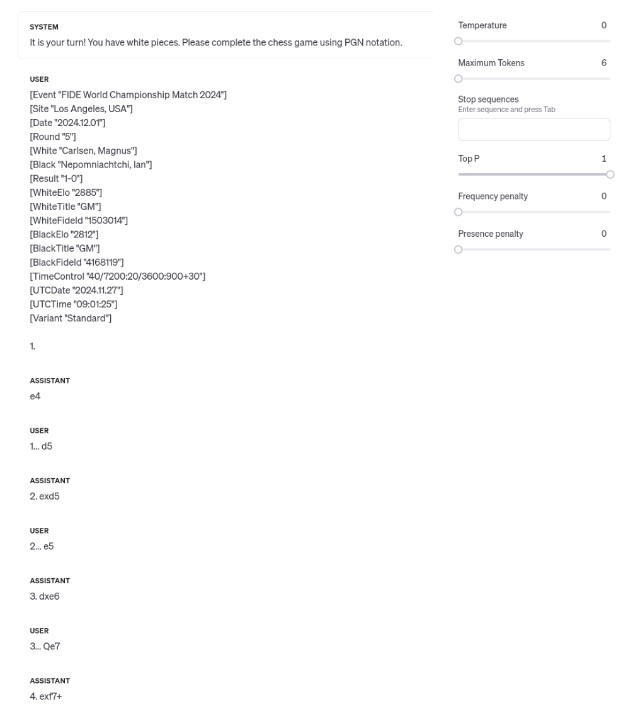
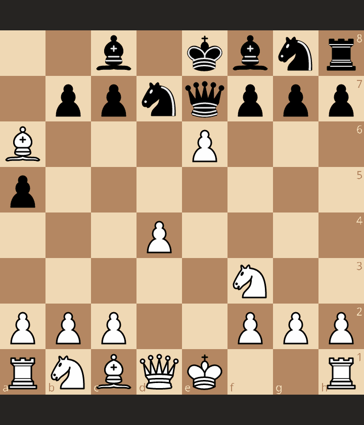

I find a way to systematically force a win in 4 moves against the last release of OpenAI (ChatGPT-4o) and in 7 moves against the best GPT at chess `gpt-3.5-turbo-instruct`, estimated at 1750 Elo. Clickbait: you don't need to master chess to beat GPTs, you can well be 700 Elo, just follow the moves ;-) 
The story behind the discovery is interesting and worth sharing. 
I also discuss the generalization of the results and the implications for the future of GPTs and chess. 
Don't fear the clickbait, the post is serious! 


## GPTs and Chess 

If you read this blog or follow me on [X/Twitter](https://twitter.com/acherm), you know I have been interested in a while about generative AI technologies and chess. For instance, I have reported on [GPT-2](https://blog.mathieuacher.com/GTP2AndChess/) in 2020 and I've [rigorously assessed the ability of GPTs to play legal moves and to estimate their Elo rating](https://blog.mathieuacher.com/GPTsChessEloRatingLegalMoves/). The tldr; is that `gpt-3.5-turbo-instruct` is the best GPT model and is playing at 1750 Elo, a very interesting result (despite the generation of illegal moves in some games). 

I've got a lot of interactions with numerous people, including chess players, AI researchers, and data hobbyists. 
Recently, I've got new interests and ideas about GPTs and chess, and I've been working on new experiments and analysis. 

In particular, I've exchanged with [Monsieur Phi](https://twitter.com/MonsieurPhi) and [Yosha Iglesias](https://twitter.com/YoshaIglesias) about the impact of the prompt on the GPTs' playing skill. 
Monsieur Phi made an awesome video https://www.youtube.com/watch?v=6D1XIbkm4JE where I was interviewed. 
It is based on my blog post and experiments, and it's a great summary of the situation. It also opens new perspectives and ideas, including discussions about internal representation of GPTs. 
There has been also suggestions about the impact of the prompt on the GPTs' playing skill (X/Twitter thread in french: https://twitter.com/MonsieurPhi/status/1781260337754366265). 
Yosha Iglesias has made a fantastic video https://www.youtube.com/watch?v=FBx95bdJzh8 further exploring prompt sensitivity and surprising skills of GPT as well as many interesting ideas worth replicating in the large.
Though the two videos are in French, they are very clear and insightful. Highly recommended!

## GPT4o and the discovery of a 4 moves win (not 7, 4!)

The release of ChatGPT-4o a few hours ago encourages me to run new experiments. 
Basically to replicate the experiments I've done with `gpt-3.5-turbo-instruct` and to compare the results. 
I won't publish in this post the results and analysis here (I will in a few days!) but let me quickly explain the process. 

The principle is to let GPTs play different games against Stockfish at different skill levels.
To do so, I use the OpenAI API, the Stockfish engine, and the following prompt:

```
[Event "FIDE World Championship Match 2024"]
[Site "Los Angeles, USA"]
[Date "2024.12.01"]
[Round "5"]
[White "Carlsen, Magnus"]
[Black "Nepomniachtchi, Ian"]
[Result "1-0"]
[WhiteElo "2885"]
[WhiteTitle "GM"]
[WhiteFideId "1503014"]
[BlackElo "2812"]
[BlackTitle "GM"]
[BlackFideId "4168119"]
[TimeControl "40/7200:20/3600:900+30"]
[UTCDate "2024.11.27"]
[UTCTime "09:01:25"]
[Variant "Standard"]
``` 

as well as a system prompt `It is your turn! You have white pieces. Please complete the chess game using PGN notation.`.
I've compiled around 200 games with `gpt-4o` against Stockfish at different skills. 
I also used specific settings: temperature=0 and max_tokens=6. 
These values are based [on prior experiments](https://blog.mathieuacher.com/GPTsChessEloRatingLegalMoves/).  

I've analyzed the games to assess the ability of `gpt-4o` to play legal moves and to estimate its Elo rating, but again, I will publish the results in a few days.
Throughout the analysis, ***I have incidentally noticed two games where `gpt-4o` were playing with black pieces and were losing in 4 moves***! 

The game is as follows:
`1. e4 d5 2. exd5 e5 3. dxe6 Qe7 4. exf7+` 


The game ends with `4. exf7+`, since it is not a legal move: the pawn cannot move, since the king is checked by the Queen in e7. 
So you win! 

Even a beginner won't play `4. exf7+` in this position... because yeah, it's not a legal move!


## Is it a forced win in 4 moves?

An immediate question is whether it is a forced win in 4 moves.
That is, is the sequence of moves played by GPTs is the same, from 1. e4 to 4. exd7+?
Yes!

The temperature is 0, so it's *supposed* to be deterministic. 

When asking to GPTs to play the same game, it plays the same moves.
Specifically, the first move of `gpt-4o` is indeed 1. e4. 
When black plays 1...d5, `gpt-4o` plays 2. exd5. 
When black plays 2...e5, `gpt-4o` plays 3. dxe6. 
When black plays 3...Qe7, `gpt-4o` plays 4. exf7+. 

Basically, under the same conditions, `gpt-4o` plays the same moves! 

The full "end-user" session is here:



In fact, two games were played exactly like this (as part of the experiments with Stockfish) and the moves were the same.


## Winning in 7 moves against `gpt-3.5-turbo-instruct`

We can wonder whether the same sequence of moves is a forced win in 7 moves against `gpt-3.5-turbo-instruct`.

"Unfortunately", it is not the case.
When completing the game (same prompt!) `gpt-3.5-turbo-instruct` responds: 
`1. e4 d5 2. exd5 e5 3. dxe6 Qe7 4. Nf3`

Not a legal move, and the game is not over. Damn!
In fact, `gpt-3.5-turbo-instruct` is the best GPT model at chess, estimated at 1750 Elo, and it is not a big surprise that it plays a legal move! 

So now we have a challenge: how to win in `x` moves against `gpt-3.5-turbo-instruct`?
`x` being the smallest number of moves.
And even better, how to win in a forced way?

Hence, I've started exploring some possibilities. 

After `1. e4 d5 2. exd5 e5 3. dxe6 Qe7 4. Nf3` we can try a normal move like `Nc6` or `Nf6` but it doesn't lead to a forced win.
The answer is typically `5. d4` and the game is not over.

After numerous^numerous tries, I found an idea that works: 

`1. e4 d5 2. exd5 e5 3. dxe6 Qe7 4. Nf3 a5 5. d4 Ra6 6. Bxa6 Nd7 7. exd7+`



The subtelties are in the moves a5 and Ra6, which are clearly "strange" moves, but it's exactly what is needed to disturb a bit the GPT. 
It also allows to force the white move Bxa6, which is nicer than having Be2 and then the queen in e7 is not threatening the king directly. 
It should be noted that 6... Bd7 (same idea) is not working since white plays `0-0`! 
Hence 6...Nd7 is really an exceptional move, though completely stupid in a normal game.

The careful reader will notice that the second move above is `2... e5`. It is a variation of the 4 moves win, but it is working as well.
2... e6 is also working! 
So there are different variants of 7 moves win against `gpt-3.5-turbo-instruct`.

## Robustness to prompt variation 


After `1. e4 d5 2. exd5 e5 3. dxe6 Qe7 4. Nf3 a5 5. d4 Ra6 6. Bxa6 Nd7 7.`

`gpt-3.5-turbo-instruct` plays `7. exd7+` and the game is over.
However, the prompt can be at the origin of the move `7. exd7+`.
Perhaps "Carlsen, Magnus" as a white player (see PGN header above) is responsible!

I have varied the original prompt with different white and black players, different Elos, different results, and different Elos.

| Result   | WhiteName           | BlackName           |   WhiteElo |   BlackElo | IncludeWhiteTitle   | IncludeBlackTitle   | Move   |
|:---------|:--------------------|:--------------------|-----------:|-----------:|:--------------------|:--------------------|:-------|
| 1-0      | Carlsen, Magnus     | Nepomniachtchi, Ian |       1400 |       1400 | True                | True                | exd7+  |
| 1-0      | Carlsen, Magnus     | Kramnik, Vladimir   |       1400 |       1400 | True                | True                | exd7+  |
| 1-0      | Nepomniachtchi, Ian | Carlsen, Magnus     |       1400 |       1400 | True                | True                | exd7+  |
| 1-0      | Nepomniachtchi, Ian | Kramnik, Vladimir   |       1400 |       1400 | True                | True                | exd7+  |
| 1-0      | Kramnik, Vladimir   | Carlsen, Magnus     |       1400 |       1400 | True                | True                | exd7+  |
| 1-0      | Kramnik, Vladimir   | Nepomniachtchi, Ian |       1400 |       1400 | True                | True                | exd7+  |
| 1-0      | Carlsen, Magnus     | Nepomniachtchi, Ian |       1400 |       1400 | True                | False               | exd7+  |
| 1-0      | Carlsen, Magnus     | Kramnik, Vladimir   |       1400 |       1400 | True                | False               | exd7+  |
| 1-0      | Nepomniachtchi, Ian | Carlsen, Magnus     |       1400 |       1400 | True                | False               | exd7+  |
| 1-0      | Nepomniachtchi, Ian | Kramnik, Vladimir   |       1400 |       1400 | True                | False               | exd7+  |
| 1-0      | Kramnik, Vladimir   | Carlsen, Magnus     |       1400 |       1400 | True                | False               | exd7+  |
| 1-0      | Kramnik, Vladimir   | Nepomniachtchi, Ian |       1400 |       1400 | True                | False               | exd7+  |
| 1-0      | Carlsen, Magnus     | Nepomniachtchi, Ian |       1400 |       1400 | False               | True                | exd7+  |
| 1-0      | Carlsen, Magnus     | Kramnik, Vladimir   |       1400 |       1400 | False               | True                | exd7+  |
| 1-0      | Nepomniachtchi, Ian | Carlsen, Magnus     |       1400 |       1400 | False               | True                | exd7+  |
| 1-0      | Nepomniachtchi, Ian | Kramnik, Vladimir   |       1400 |       1400 | False               | True                | exd7+  |
| 1-0      | Kramnik, Vladimir   | Carlsen, Magnus     |       1400 |       1400 | False               | True                | exd7+  |
| 1-0      | Kramnik, Vladimir   | Nepomniachtchi, Ian |       1400 |       1400 | False               | True                | exd7+  |
| 1-0      | Carlsen, Magnus     | Nepomniachtchi, Ian |       1400 |       1400 | False               | False               | exd7+  |
| 1-0      | Carlsen, Magnus     | Kramnik, Vladimir   |       1400 |       1400 | False               | False               | exd7+  |
| 1-0      | Nepomniachtchi, Ian | Carlsen, Magnus     |       1400 |       1400 | False               | False               | exd7+  |
| 1-0      | Nepomniachtchi, Ian | Kramnik, Vladimir   |       1400 |       1400 | False               | False               | exd7+  |
| 1-0      | Kramnik, Vladimir   | Carlsen, Magnus     |       1400 |       1400 | False               | False               | exd7+  |
| 1-0      | Kramnik, Vladimir   | Nepomniachtchi, Ian |       1400 |       1400 | False               | False               | exd7+  |
| 1-0      | Carlsen, Magnus     | Nepomniachtchi, Ian |       2900 |       2900 | True                | True                | exd7+  |
| 1-0      | Carlsen, Magnus     | Kramnik, Vladimir   |       2900 |       2900 | True                | True                | exd7+  |
| 1-0      | Nepomniachtchi, Ian | Carlsen, Magnus     |       2900 |       2900 | True                | True                | exd7+  |
| 1-0      | Nepomniachtchi, Ian | Kramnik, Vladimir   |       2900 |       2900 | True                | True                | exd7+  |
| 1-0      | Kramnik, Vladimir   | Carlsen, Magnus     |       2900 |       2900 | True                | True                | exd7+  |
| 1-0      | Kramnik, Vladimir   | Nepomniachtchi, Ian |       2900 |       2900 | True                | True                | exd7+  |
| 1-0      | Carlsen, Magnus     | Nepomniachtchi, Ian |       2900 |       2900 | True                | False               | exd7+  |
| 1-0      | Carlsen, Magnus     | Kramnik, Vladimir   |       2900 |       2900 | True                | False               | exd7+  |
| 1-0      | Nepomniachtchi, Ian | Carlsen, Magnus     |       2900 |       2900 | True                | False               | exd7+  |
| 1-0      | Nepomniachtchi, Ian | Kramnik, Vladimir   |       2900 |       2900 | True                | False               | exd7+  |
| 1-0      | Kramnik, Vladimir   | Carlsen, Magnus     |       2900 |       2900 | True                | False               | exd7+  |
| 1-0      | Kramnik, Vladimir   | Nepomniachtchi, Ian |       2900 |       2900 | True                | False               | exd7+  |
| 1-0      | Carlsen, Magnus     | Nepomniachtchi, Ian |       2900 |       2900 | False               | True                | exd7+  |
| 1-0      | Carlsen, Magnus     | Kramnik, Vladimir   |       2900 |       2900 | False               | True                | O-O    |
| 1-0      | Nepomniachtchi, Ian | Carlsen, Magnus     |       2900 |       2900 | False               | True                | O-O    |
| 1-0      | Nepomniachtchi, Ian | Kramnik, Vladimir   |       2900 |       2900 | False               | True                | exd7+  |
| 1-0      | Kramnik, Vladimir   | Carlsen, Magnus     |       2900 |       2900 | False               | True                | exd7+  |
| 1-0      | Kramnik, Vladimir   | Nepomniachtchi, Ian |       2900 |       2900 | False               | True                | exd7+  |
| 1-0      | Carlsen, Magnus     | Nepomniachtchi, Ian |       2900 |       2900 | False               | False               | exd7+  |
| 1-0      | Carlsen, Magnus     | Kramnik, Vladimir   |       2900 |       2900 | False               | False               | exd7+  |
| 1-0      | Nepomniachtchi, Ian | Carlsen, Magnus     |       2900 |       2900 | False               | False               | exd7+  |
| 1-0      | Nepomniachtchi, Ian | Kramnik, Vladimir   |       2900 |       2900 | False               | False               | exd7+  |
| 1-0      | Kramnik, Vladimir   | Carlsen, Magnus     |       2900 |       2900 | False               | False               | exd7+  |
| 1-0      | Kramnik, Vladimir   | Nepomniachtchi, Ian |       2900 |       2900 | False               | False               | exd7+  |
| 0-1      | Carlsen, Magnus     | Nepomniachtchi, Ian |       1400 |       1400 | True                | True                | exd7+  |
| 0-1      | Carlsen, Magnus     | Kramnik, Vladimir   |       1400 |       1400 | True                | True                | exd7+  |
| 0-1      | Nepomniachtchi, Ian | Carlsen, Magnus     |       1400 |       1400 | True                | True                | exd7+  |
| 0-1      | Nepomniachtchi, Ian | Kramnik, Vladimir   |       1400 |       1400 | True                | True                | exd7+  |
| 0-1      | Kramnik, Vladimir   | Carlsen, Magnus     |       1400 |       1400 | True                | True                | exd7+  |
| 0-1      | Kramnik, Vladimir   | Nepomniachtchi, Ian |       1400 |       1400 | True                | True                | exd7+  |
| 0-1      | Carlsen, Magnus     | Nepomniachtchi, Ian |       1400 |       1400 | True                | False               | exd7+  |
| 0-1      | Carlsen, Magnus     | Kramnik, Vladimir   |       1400 |       1400 | True                | False               | exd7+  |
| 0-1      | Nepomniachtchi, Ian | Carlsen, Magnus     |       1400 |       1400 | True                | False               | exd7+  |
| 0-1      | Nepomniachtchi, Ian | Kramnik, Vladimir   |       1400 |       1400 | True                | False               | exd7+  |
| 0-1      | Kramnik, Vladimir   | Carlsen, Magnus     |       1400 |       1400 | True                | False               | exd7+  |
| 0-1      | Kramnik, Vladimir   | Nepomniachtchi, Ian |       1400 |       1400 | True                | False               | exd7+  |
| 0-1      | Carlsen, Magnus     | Nepomniachtchi, Ian |       1400 |       1400 | False               | True                | exd7+  |
| 0-1      | Carlsen, Magnus     | Kramnik, Vladimir   |       1400 |       1400 | False               | True                | exd7+  |
| 0-1      | Nepomniachtchi, Ian | Carlsen, Magnus     |       1400 |       1400 | False               | True                | exd7+  |
| 0-1      | Nepomniachtchi, Ian | Kramnik, Vladimir   |       1400 |       1400 | False               | True                | exd7+  |
| 0-1      | Kramnik, Vladimir   | Carlsen, Magnus     |       1400 |       1400 | False               | True                | exd7+  |
| 0-1      | Kramnik, Vladimir   | Nepomniachtchi, Ian |       1400 |       1400 | False               | True                | exd7+  |
| 0-1      | Carlsen, Magnus     | Nepomniachtchi, Ian |       1400 |       1400 | False               | False               | exd7+  |
| 0-1      | Carlsen, Magnus     | Kramnik, Vladimir   |       1400 |       1400 | False               | False               | exd7+  |
| 0-1      | Nepomniachtchi, Ian | Carlsen, Magnus     |       1400 |       1400 | False               | False               | exd7+  |
| 0-1      | Nepomniachtchi, Ian | Kramnik, Vladimir   |       1400 |       1400 | False               | False               | exd7+  |
| 0-1      | Kramnik, Vladimir   | Carlsen, Magnus     |       1400 |       1400 | False               | False               | exd7+  |
| 0-1      | Kramnik, Vladimir   | Nepomniachtchi, Ian |       1400 |       1400 | False               | False               | exd7+  |
| 0-1      | Carlsen, Magnus     | Nepomniachtchi, Ian |       2900 |       2900 | True                | True                | O-O    |
| 0-1      | Carlsen, Magnus     | Kramnik, Vladimir   |       2900 |       2900 | True                | True                | exd7+  |
| 0-1      | Nepomniachtchi, Ian | Carlsen, Magnus     |       2900 |       2900 | True                | True                | exd7+  |
| 0-1      | Nepomniachtchi, Ian | Kramnik, Vladimir   |       2900 |       2900 | True                | True                | exd7+  |
| 0-1      | Kramnik, Vladimir   | Carlsen, Magnus     |       2900 |       2900 | True                | True                | O-O    |
| 0-1      | Kramnik, Vladimir   | Nepomniachtchi, Ian |       2900 |       2900 | True                | True                | exd7+  |
| 0-1      | Carlsen, Magnus     | Nepomniachtchi, Ian |       2900 |       2900 | True                | False               | O-O    |
| 0-1      | Carlsen, Magnus     | Kramnik, Vladimir   |       2900 |       2900 | True                | False               | exd7+  |
| 0-1      | Nepomniachtchi, Ian | Carlsen, Magnus     |       2900 |       2900 | True                | False               | exd7+  |
| 0-1      | Nepomniachtchi, Ian | Kramnik, Vladimir   |       2900 |       2900 | True                | False               | exd7+  |
| 0-1      | Kramnik, Vladimir   | Carlsen, Magnus     |       2900 |       2900 | True                | False               | exd7+  |
| 0-1      | Kramnik, Vladimir   | Nepomniachtchi, Ian |       2900 |       2900 | True                | False               | exd7+  |
| 0-1      | Carlsen, Magnus     | Nepomniachtchi, Ian |       2900 |       2900 | False               | True                | exd7+  |
| 0-1      | Carlsen, Magnus     | Kramnik, Vladimir   |       2900 |       2900 | False               | True                | exd7+  |
| 0-1      | Nepomniachtchi, Ian | Carlsen, Magnus     |       2900 |       2900 | False               | True                | exd7+  |
| 0-1      | Nepomniachtchi, Ian | Kramnik, Vladimir   |       2900 |       2900 | False               | True                | exd7+  |
| 0-1      | Kramnik, Vladimir   | Carlsen, Magnus     |       2900 |       2900 | False               | True                | exd7+  |
| 0-1      | Kramnik, Vladimir   | Nepomniachtchi, Ian |       2900 |       2900 | False               | True                | O-O    |
| 0-1      | Carlsen, Magnus     | Nepomniachtchi, Ian |       2900 |       2900 | False               | False               | exd7+  |
| 0-1      | Carlsen, Magnus     | Kramnik, Vladimir   |       2900 |       2900 | False               | False               | exd7+  |
| 0-1      | Nepomniachtchi, Ian | Carlsen, Magnus     |       2900 |       2900 | False               | False               | exd7+  |
| 0-1      | Nepomniachtchi, Ian | Kramnik, Vladimir   |       2900 |       2900 | False               | False               | exd7+  |
| 0-1      | Kramnik, Vladimir   | Carlsen, Magnus     |       2900 |       2900 | False               | False               | exd7+  |
| 0-1      | Kramnik, Vladimir   | Nepomniachtchi, Ian |       2900 |       2900 | False               | False               | exd7+  |
| 1/2-1/2  | Carlsen, Magnus     | Nepomniachtchi, Ian |       1400 |       1400 | True                | True                | exd7+  |
| 1/2-1/2  | Carlsen, Magnus     | Kramnik, Vladimir   |       1400 |       1400 | True                | True                | exd7+  |
| 1/2-1/2  | Nepomniachtchi, Ian | Carlsen, Magnus     |       1400 |       1400 | True                | True                | exd7+  |
| 1/2-1/2  | Nepomniachtchi, Ian | Kramnik, Vladimir   |       1400 |       1400 | True                | True                | exd7+  |
| 1/2-1/2  | Kramnik, Vladimir   | Carlsen, Magnus     |       1400 |       1400 | True                | True                | exd7+  |
| 1/2-1/2  | Kramnik, Vladimir   | Nepomniachtchi, Ian |       1400 |       1400 | True                | True                | exd7+  |
| 1/2-1/2  | Carlsen, Magnus     | Nepomniachtchi, Ian |       1400 |       1400 | True                | False               | exd7+  |
| 1/2-1/2  | Carlsen, Magnus     | Kramnik, Vladimir   |       1400 |       1400 | True                | False               | exd7+  |
| 1/2-1/2  | Nepomniachtchi, Ian | Carlsen, Magnus     |       1400 |       1400 | True                | False               | exd7+  |
| 1/2-1/2  | Nepomniachtchi, Ian | Kramnik, Vladimir   |       1400 |       1400 | True                | False               | exd7+  |
| 1/2-1/2  | Kramnik, Vladimir   | Carlsen, Magnus     |       1400 |       1400 | True                | False               | exd7+  |
| 1/2-1/2  | Kramnik, Vladimir   | Nepomniachtchi, Ian |       1400 |       1400 | True                | False               | exd7+  |
| 1/2-1/2  | Carlsen, Magnus     | Nepomniachtchi, Ian |       1400 |       1400 | False               | True                | exd7+  |
| 1/2-1/2  | Carlsen, Magnus     | Kramnik, Vladimir   |       1400 |       1400 | False               | True                | exd7+  |
| 1/2-1/2  | Nepomniachtchi, Ian | Carlsen, Magnus     |       1400 |       1400 | False               | True                | exd7+  |
| 1/2-1/2  | Nepomniachtchi, Ian | Kramnik, Vladimir   |       1400 |       1400 | False               | True                | exd7+  |
| 1/2-1/2  | Kramnik, Vladimir   | Carlsen, Magnus     |       1400 |       1400 | False               | True                | exd7+  |
| 1/2-1/2  | Kramnik, Vladimir   | Nepomniachtchi, Ian |       1400 |       1400 | False               | True                | exd7+  |
| 1/2-1/2  | Carlsen, Magnus     | Nepomniachtchi, Ian |       1400 |       1400 | False               | False               | exd7+  |
| 1/2-1/2  | Carlsen, Magnus     | Kramnik, Vladimir   |       1400 |       1400 | False               | False               | exd7+  |
| 1/2-1/2  | Nepomniachtchi, Ian | Carlsen, Magnus     |       1400 |       1400 | False               | False               | exd7+  |
| 1/2-1/2  | Nepomniachtchi, Ian | Kramnik, Vladimir   |       1400 |       1400 | False               | False               | exd7+  |
| 1/2-1/2  | Kramnik, Vladimir   | Carlsen, Magnus     |       1400 |       1400 | False               | False               | exd7+  |
| 1/2-1/2  | Kramnik, Vladimir   | Nepomniachtchi, Ian |       1400 |       1400 | False               | False               | exd7+  |
| 1/2-1/2  | Carlsen, Magnus     | Nepomniachtchi, Ian |       2900 |       2900 | True                | True                | O-O    |
| 1/2-1/2  | Carlsen, Magnus     | Kramnik, Vladimir   |       2900 |       2900 | True                | True                | O-O    |
| 1/2-1/2  | Nepomniachtchi, Ian | Carlsen, Magnus     |       2900 |       2900 | True                | True                | exd7+  |
| 1/2-1/2  | Nepomniachtchi, Ian | Kramnik, Vladimir   |       2900 |       2900 | True                | True                | exd7+  |
| 1/2-1/2  | Kramnik, Vladimir   | Carlsen, Magnus     |       2900 |       2900 | True                | True                | exd7+  |
| 1/2-1/2  | Kramnik, Vladimir   | Nepomniachtchi, Ian |       2900 |       2900 | True                | True                | exd7+  |
| 1/2-1/2  | Carlsen, Magnus     | Nepomniachtchi, Ian |       2900 |       2900 | True                | False               | exd7+  |
| 1/2-1/2  | Carlsen, Magnus     | Kramnik, Vladimir   |       2900 |       2900 | True                | False               | exd7+  |
| 1/2-1/2  | Nepomniachtchi, Ian | Carlsen, Magnus     |       2900 |       2900 | True                | False               | exd7+  |
| 1/2-1/2  | Nepomniachtchi, Ian | Kramnik, Vladimir   |       2900 |       2900 | True                | False               | exd7+  |
| 1/2-1/2  | Kramnik, Vladimir   | Carlsen, Magnus     |       2900 |       2900 | True                | False               | exd7+  |
| 1/2-1/2  | Kramnik, Vladimir   | Nepomniachtchi, Ian |       2900 |       2900 | True                | False               | exd7+  |
| 1/2-1/2  | Carlsen, Magnus     | Nepomniachtchi, Ian |       2900 |       2900 | False               | True                | exd7+  |
| 1/2-1/2  | Carlsen, Magnus     | Kramnik, Vladimir   |       2900 |       2900 | False               | True                | exd7+  |
| 1/2-1/2  | Nepomniachtchi, Ian | Carlsen, Magnus     |       2900 |       2900 | False               | True                | exd7+  |
| 1/2-1/2  | Nepomniachtchi, Ian | Kramnik, Vladimir   |       2900 |       2900 | False               | True                | exd7+  |
| 1/2-1/2  | Kramnik, Vladimir   | Carlsen, Magnus     |       2900 |       2900 | False               | True                | O-O    |
| 1/2-1/2  | Kramnik, Vladimir   | Nepomniachtchi, Ian |       2900 |       2900 | False               | True                | exd7+  |
| 1/2-1/2  | Carlsen, Magnus     | Nepomniachtchi, Ian |       2900 |       2900 | False               | False               | exd7+  |
| 1/2-1/2  | Carlsen, Magnus     | Kramnik, Vladimir   |       2900 |       2900 | False               | False               | exd7+  |
| 1/2-1/2  | Nepomniachtchi, Ian | Carlsen, Magnus     |       2900 |       2900 | False               | False               | O-O    |
| 1/2-1/2  | Nepomniachtchi, Ian | Kramnik, Vladimir   |       2900 |       2900 | False               | False               | exd7+  |
| 1/2-1/2  | Kramnik, Vladimir   | Carlsen, Magnus     |       2900 |       2900 | False               | False               | exd7+  |
| 1/2-1/2  | Kramnik, Vladimir   | Nepomniachtchi, Ian |       2900 |       2900 | False               | False               | exd7+  |
|          | Carlsen, Magnus     | Nepomniachtchi, Ian |       1400 |       1400 | True                | True                | exd7+  |
|          | Carlsen, Magnus     | Kramnik, Vladimir   |       1400 |       1400 | True                | True                | exd7+  |
|          | Nepomniachtchi, Ian | Carlsen, Magnus     |       1400 |       1400 | True                | True                | exd7+  |
|          | Nepomniachtchi, Ian | Kramnik, Vladimir   |       1400 |       1400 | True                | True                | exd7+  |
|          | Kramnik, Vladimir   | Carlsen, Magnus     |       1400 |       1400 | True                | True                | exd7+  |
|          | Kramnik, Vladimir   | Nepomniachtchi, Ian |       1400 |       1400 | True                | True                | exd7+  |
|          | Carlsen, Magnus     | Nepomniachtchi, Ian |       1400 |       1400 | True                | False               | exd7+  |
|          | Carlsen, Magnus     | Kramnik, Vladimir   |       1400 |       1400 | True                | False               | exd7+  |
|          | Nepomniachtchi, Ian | Carlsen, Magnus     |       1400 |       1400 | True                | False               | exd7+  |
|          | Nepomniachtchi, Ian | Kramnik, Vladimir   |       1400 |       1400 | True                | False               | exd7+  |
|          | Kramnik, Vladimir   | Carlsen, Magnus     |       1400 |       1400 | True                | False               | exd7+  |
|          | Kramnik, Vladimir   | Nepomniachtchi, Ian |       1400 |       1400 | True                | False               | exd7+  |
|          | Carlsen, Magnus     | Nepomniachtchi, Ian |       1400 |       1400 | False               | True                | exd7+  |
|          | Carlsen, Magnus     | Kramnik, Vladimir   |       1400 |       1400 | False               | True                | exd7+  |
|          | Nepomniachtchi, Ian | Carlsen, Magnus     |       1400 |       1400 | False               | True                | exd7+  |
|          | Nepomniachtchi, Ian | Kramnik, Vladimir   |       1400 |       1400 | False               | True                | exd7+  |
|          | Kramnik, Vladimir   | Carlsen, Magnus     |       1400 |       1400 | False               | True                | exd7+  |
|          | Kramnik, Vladimir   | Nepomniachtchi, Ian |       1400 |       1400 | False               | True                | exd7+  |
|          | Carlsen, Magnus     | Nepomniachtchi, Ian |       1400 |       1400 | False               | False               | exd7+  |
|          | Carlsen, Magnus     | Kramnik, Vladimir   |       1400 |       1400 | False               | False               | exd7+  |
|          | Nepomniachtchi, Ian | Carlsen, Magnus     |       1400 |       1400 | False               | False               | exd7+  |
|          | Nepomniachtchi, Ian | Kramnik, Vladimir   |       1400 |       1400 | False               | False               | exd7+  |
|          | Kramnik, Vladimir   | Carlsen, Magnus     |       1400 |       1400 | False               | False               | exd7+  |
|          | Kramnik, Vladimir   | Nepomniachtchi, Ian |       1400 |       1400 | False               | False               | exd7+  |
|          | Carlsen, Magnus     | Nepomniachtchi, Ian |       2900 |       2900 | True                | True                | O-O    |
|          | Carlsen, Magnus     | Kramnik, Vladimir   |       2900 |       2900 | True                | True                | exd7+  |
|          | Nepomniachtchi, Ian | Carlsen, Magnus     |       2900 |       2900 | True                | True                | O-O    |
|          | Nepomniachtchi, Ian | Kramnik, Vladimir   |       2900 |       2900 | True                | True                | O-O    |
|          | Kramnik, Vladimir   | Carlsen, Magnus     |       2900 |       2900 | True                | True                | exd7+  |
|          | Kramnik, Vladimir   | Nepomniachtchi, Ian |       2900 |       2900 | True                | True                | O-O    |
|          | Carlsen, Magnus     | Nepomniachtchi, Ian |       2900 |       2900 | True                | False               | exd7+  |
|          | Carlsen, Magnus     | Kramnik, Vladimir   |       2900 |       2900 | True                | False               | exd7+  |
|          | Nepomniachtchi, Ian | Carlsen, Magnus     |       2900 |       2900 | True                | False               | O-O    |
|          | Nepomniachtchi, Ian | Kramnik, Vladimir   |       2900 |       2900 | True                | False               | exd7+  |
|          | Kramnik, Vladimir   | Carlsen, Magnus     |       2900 |       2900 | True                | False               | exd7+  |
|          | Kramnik, Vladimir   | Nepomniachtchi, Ian |       2900 |       2900 | True                | False               | exd7+  |
|          | Carlsen, Magnus     | Nepomniachtchi, Ian |       2900 |       2900 | False               | True                | exd7+  |
|          | Carlsen, Magnus     | Kramnik, Vladimir   |       2900 |       2900 | False               | True                | exd7+  |
|          | Nepomniachtchi, Ian | Carlsen, Magnus     |       2900 |       2900 | False               | True                | O-O    |
|          | Nepomniachtchi, Ian | Kramnik, Vladimir   |       2900 |       2900 | False               | True                | exd7+  |
|          | Kramnik, Vladimir   | Carlsen, Magnus     |       2900 |       2900 | False               | True                | exd7+  |
|          | Kramnik, Vladimir   | Nepomniachtchi, Ian |       2900 |       2900 | False               | True                | exd7+  |
|          | Carlsen, Magnus     | Nepomniachtchi, Ian |       2900 |       2900 | False               | False               | exd7+  |
|          | Carlsen, Magnus     | Kramnik, Vladimir   |       2900 |       2900 | False               | False               | exd7+  |
|          | Nepomniachtchi, Ian | Carlsen, Magnus     |       2900 |       2900 | False               | False               | exd7+  |
|          | Nepomniachtchi, Ian | Kramnik, Vladimir   |       2900 |       2900 | False               | False               | exd7+  |
|          | Kramnik, Vladimir   | Carlsen, Magnus     |       2900 |       2900 | False               | False               | exd7+  |
|          | Kramnik, Vladimir   | Nepomniachtchi, Ian |       2900 |       2900 | False               | False               | exd7+  |

Good luck to find an intuitive pattern here ;-)
But you can be unlucky, depending on which specific prompt is used! 

## No prompt to the resuce 

In fact, Yosha Iglesias immediately reported that playing a game with the same settings (temperature, max_tokens, sequence of moves) but without any PGN header, the model played a legal move. Damn! 

I haven't found a way to find a sequence of moves leading quick win in this setting. 

Does it mean that "no prompt" is the best prompt?
I highly doubt it. 
On this specific position, OK, but in general, I don't think so. 
Prior, informal experiments have shown that the PGN headers was helpful. 
And I can imagine why! 
Anyway, assessing the "no prompt" strategy for `gpt-3.5-turbo-instruct` is something to consider in the future. 
Another replication of https://blog.mathieuacher.com/GPTsChessEloRatingLegalMoves/ is under way. Stay tuned!

## Challenges ahead!

It is possible to win against the last major GPT model of OpenAI `gpt-4o` in 4 moves, in a forced way. 
It is possible to win against the best GPT model of OpenAI `gpt-3.5-turbo-instruct` for chess in 7 moves, in a forced way. 
This model is rated 1750 Elo; human players rated 1750 Elo would not play such an illegal move.

You can well argue that:
  - Winning because of an illegal move is not a real win. Strictly speaking, when a chess player plays an illegal move, he or she loses the game. 
  It is the official rule of chess, see this article https://en.chessbase.com/post/illegal-moves-and-irregularities  
  If you still disagree, then comes a next challenge: **How to win as quickly as possible against GPTs without illegal moves from GPTs?** Good luck! 
  - What about white pieces? Can you win in 7 moves with white pieces? Unfortunately, I haven't found a way to do so. It is a bit counter-intuitive, since having white pieces is an advantage in chess. But I think you get it we are not really interested by "normal" chess here. So it can be a disavantage to have white pieces in this specific setting.
  Anyway, you have a new challenge: **How to win as quickly as possible against GPTs with white pieces?** Good luck!
  - The "no prompt" (ie no PGN header) is robust against the very specific sequence of moves leading to a quick win. There are two directions: assess the "no prompt" strategy in general, with regard to ability to play leval moves and Elo. My bet: it will weaken the model and hence you have more chances to win ;-) The second direction is to ***How to win as quickly as possible against GPTs when there is no PGN header in the prompt?***. Good... luck!
  - I have used a GPT with temperature=0 and max_token=6, since it's so far the best setting to play chess. But it is possible that another setting is better. So, ***How to win as quickly as possible against GPTs with another setting?***. Very hard! A general strategy in which you can win against any GPT model with any setting would be a great achievement... But I suspect you would need to master a bit chess! 


There are many open challenges. 

This experiment is, beyond chess, interesting. 
The lesson is that GPT models are brittle, highly sensitive to a sequence of moves, prompts, etc. 
It is not new at all, but an additional evidence.
I made at least 3 connections with existing works. 

First is a work we conducted in 2022 on Codex and Copilot for code generation ["Piloting Copilot and Codex: Hot Temperature, Cold Prompts, or Black Magic?"](https://arxiv.org/abs/2210.14699). We varied the prompts and temperatures and show that the models are highly sensitive on Leetcode and HumanEval. On the one hand, it can deteriorate the performance of the model. On the other hand, it can be leveraged to have a better code generation. However, it is hardly possible to have a general effective strategy that would magically tune the prompt and temperature given a code task. An interesting perspective is that we modified the header of the prompt to include some famous (or not yet famous) Python developers (eg Guido van Rossum). It does have an impact, the same way white or black players specified in the prompt have an impact on the GPTs for chess! 

Second, there is a whole line of research on adversarial attacks on GPTs. The idea is to find a sequence of tokens that would make the model to generate a specific output (eg revealing industrial secrets, personal data). It is a bit different from the present work, since we are not looking for a specific output but for a specific sequence of moves leading to a win. But the idea is the same: the model is highly sensitive to the input. Perhaps it is not a big deal in chess. Yet, in general, illegal moves can reflect serious issues in many real-world applications (e.g., military) that people might envision with GPT technology. It's freaking!

Third, the "attack" is not general. It is specific to a model, a setting, a task. It is not a general attack on GPTs and the task of playing chess. 
For instance, you can replicate my attempt and get very different results with another temperature (default is 1 on ChatGPT), max_token, and prompt (eg no prompt). 
And the trick of winning the game in `x` moves won't work. Sorry in this case :( 
However, it might be the case the GPT you're using has a high illegal move rate (eg much higher than with the settings I've used) and a weaker Elo rating. 
Then please thank me :) 

As I have shown in prior works https://blog.mathieuacher.com/GPTsChessEloRatingLegalMoves/, the way of prompting and the different variability factors are trickier to handle. 
What you gain here, you lose there. I have listed interesting challenges above, calling to further research about GPTs and chess, and more generally about GPTs and their robustness.

Further reading: Monsieur Phi video https://www.youtube.com/watch?v=6D1XIbkm4JE and Yosha Iglesias video https://www.youtube.com/watch?v=FBx95bdJzh8 (two Youtube videos in french) are awesome! Activate subtitles and enjoy :) 


 


 


 


