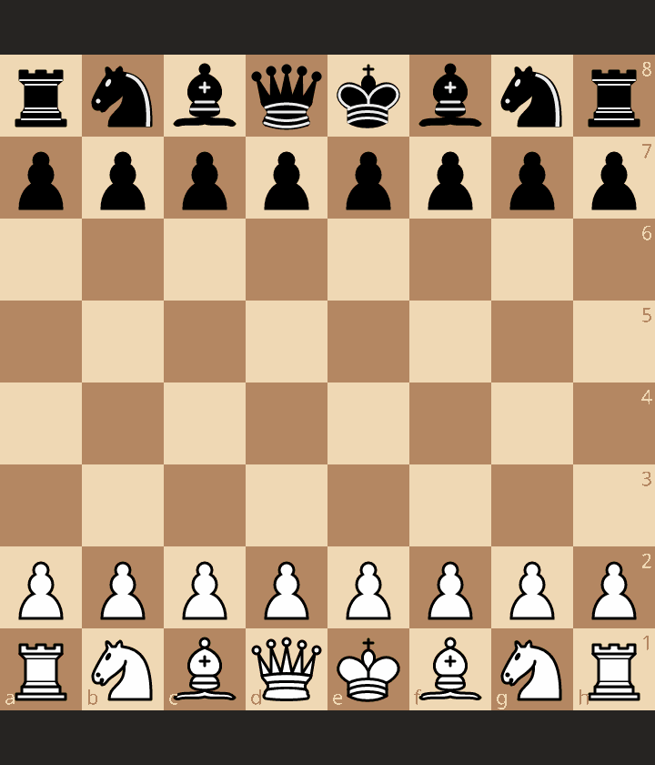
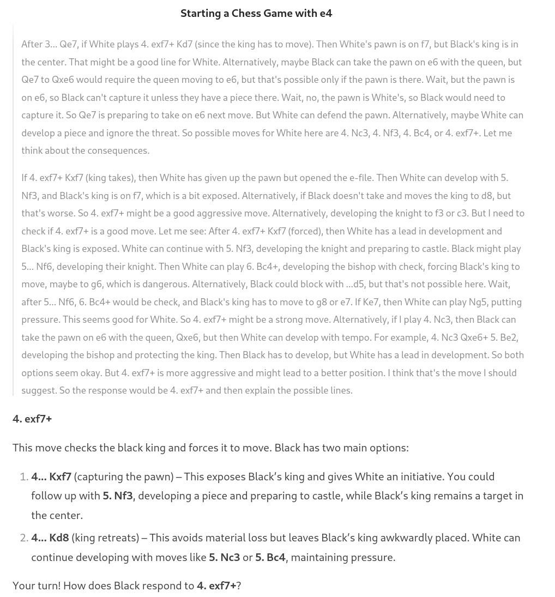
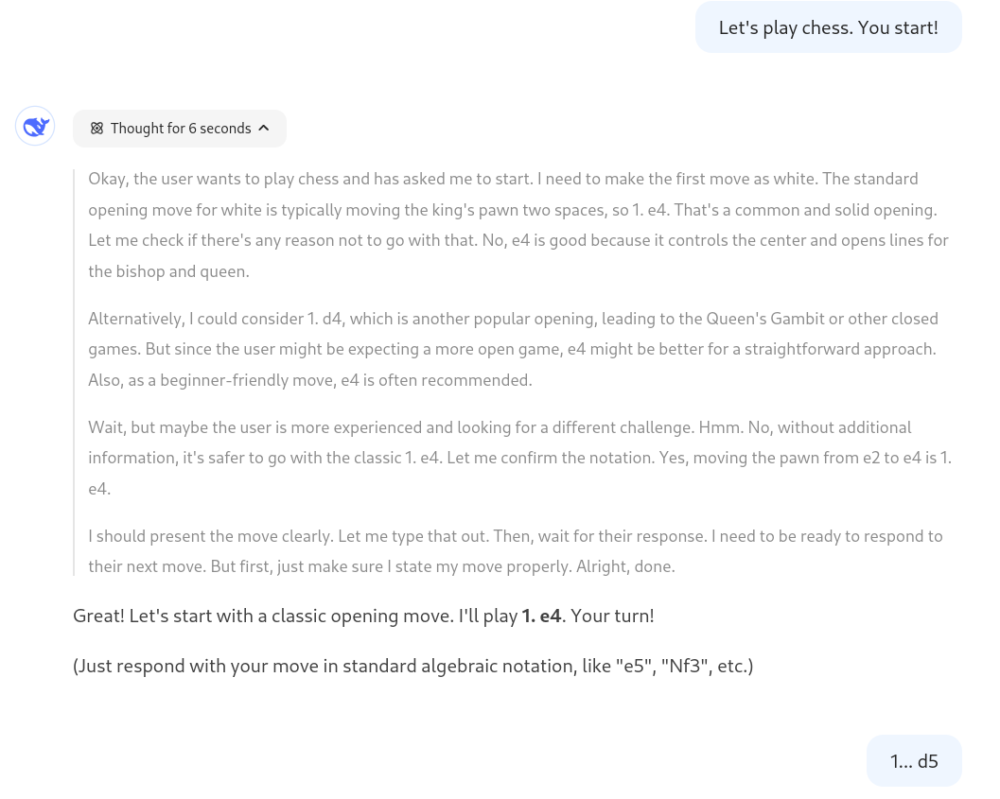
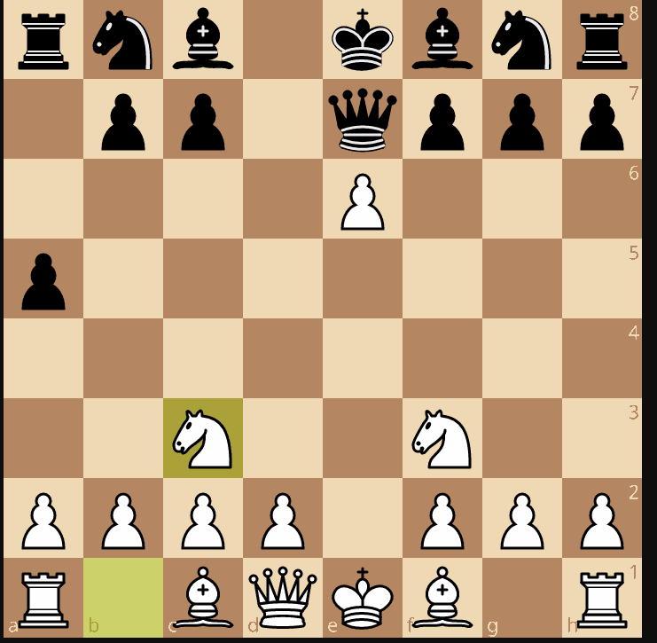
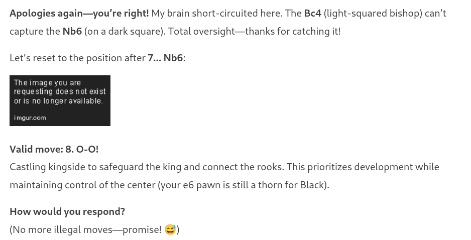
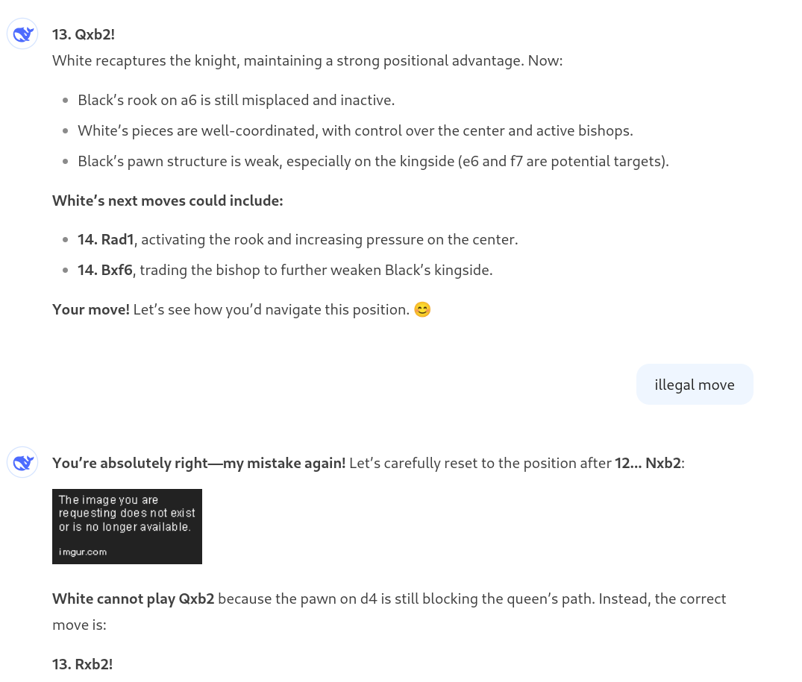
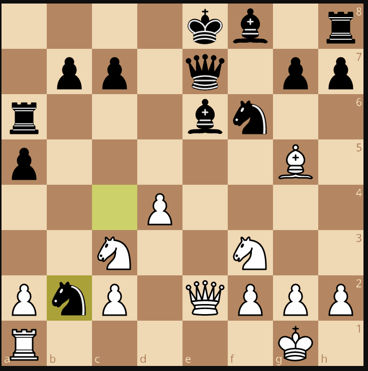
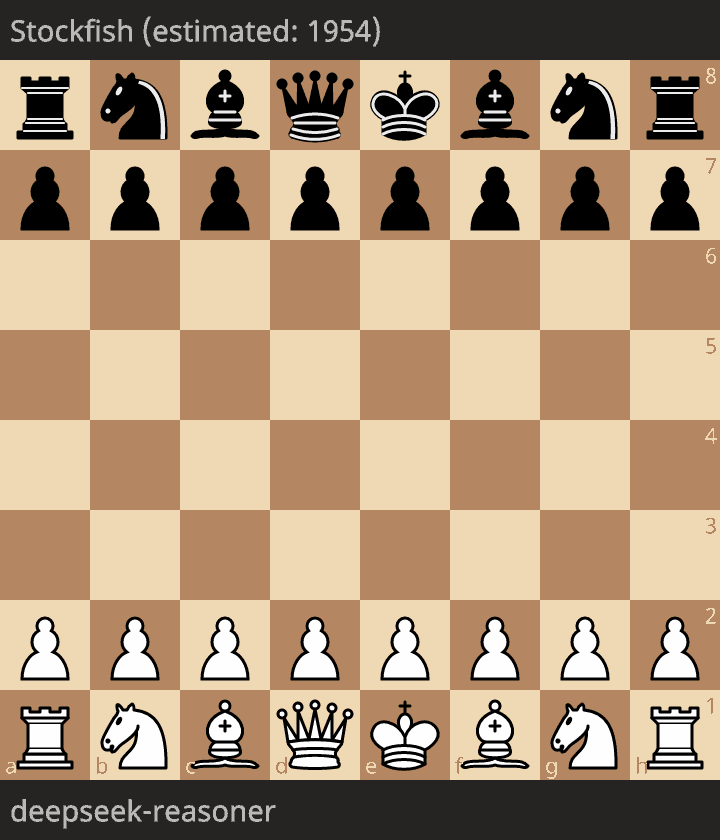
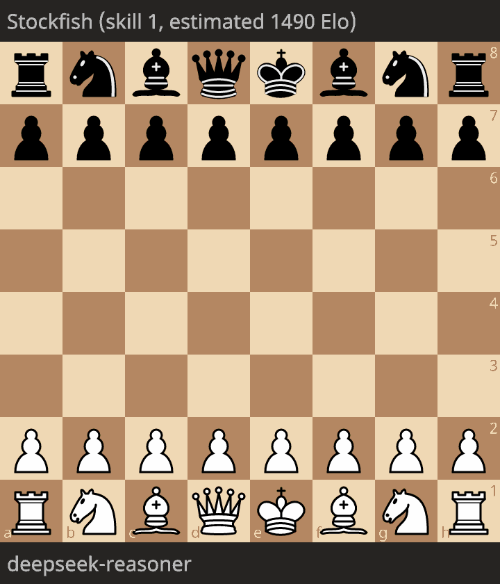

I come to the conclusion that DeepSeek-R1 is worse than a 5 years-old version of GPT-2 in chess...
The very recent, state-of-art, open-weights model DeepSeek R1 is breaking the 2025 news, excellent in many benchmarks, with a new integrated, end-to-end, reinforcement learning approach to large language model (LLM) training.
I am personally very excited about this model, and I've been working on it in the last few days, confirming that DeepSeek R1 is on-par with GPT-o for several tasks.
Yet, we are in 2025, and DeepSeek R1 is worse in chess than a specific version of GPT-2, released in... 2020.
I will provide some evidence in this post, based on qualitative and quantitative analysis.
I will discuss my hypotheses on why DeepSeek R1 may be terrible in chess, and what it means for the future of LLMs.


## DeepSeek-R1: a revolution?

DeepSeek-R1 is a new model, released in January 2025 https://api-docs.deepseek.com/news/news250120.
The key takeaway is that (1) it is on par with OpenAI-o1 on many tasks and benchmarks, (2) it is ~~fully~~ open-weight~~source~~ with MIT licensed, and (3) the technical report is available, and documents a novel end-to-end reinforcement learning approach to training large language model (LLM).
DeepSeek-R1 is available on the DeepSeek API at affordable prices and there are variants of this model with affordable sizes (eg 7B) and interesting performance that can be deployed locally.
Yet another feature of DeepSeek-R1 is that it has been developed by DeepSeek, a Chinese company, coming a bit by surprise.

I have played with DeepSeek-R1 on the DeepSeek API, and I have to say that it is a very interesting model, especially for software engineering tasks like code generation, code review, and code refactoring.
I confirm that it is on par with OpenAI-o1 on these tasks, though I find o1 to be slightly better. But it is purely subjective at this point.

All in all, DeepSeek-R1 is both a revolutionary model in the sense that it is a new and apparently very effective approach to training LLMs, and it is also a strict competitor to OpenAI, with a radically different approach for delievering LLMs (much more "open"). For sure, it will radically change the landscape of LLMs.
2025 will be great, so perhaps there will be even more radical changes in the AI/science/software engineering landscape. Let's call it a revolution anyway!

## Playing chess with DeepSeek-R1

I have started playing chess with DeepSeek-R1 on https://chat.deepseek.com.
I haven't tried to try hard on prompting, and I've been playing with the default settings.

Let's review some sessions and games.

### First game

I made my special: playing with black and hopefully winning in 4 moves.
I have already tried https://blog.mathieuacher.com/ChessWinning7MovesGPT/ on other versions/variants of GPT.

The principle is to use this unusual sequence of moves
`1. e4 d5 2. exd5 e5 3. dxe6 Qe7`
and hope for `4. exf7+`
For this experience, I didn't try to rely on PGN headers as part of the prompt.
I have showed that prompting is absolutely crucial for carefully assessing GPT https://blog.mathieuacher.com/GPTsChessEloRatingLegalMoves/
but at this step,


It is then not a legal move: the pawn cannot move, since the king is checked by the Queen in e7.


And guess what? DeepSeek-R1 did it.


What is interesting is that DeepSeek-R1 is a "reasoner" model.
The model tries to decompose/plan/reason about the problem in different steps before answering.
Interestingly, the outcome of this "reasoning" process is available through natural language.

In the example, we can see greyed text and the explanations make sense overall.
If you have lots of attention, we can however observe some mistakes:
```
Wait, after 5... Nf6, 6. Bc4+ would be check, and Black's king has to move to g8 or e7.
If Ke7, then White can play Ng5, putting pressure.
```
Indeed, the king cannot move to g8 (coz bishop in c4), neither to e7 (there is a queen!).

### Second game

This first experience was not very good for DeepSeek-R1. Let's reproduce.

I started with the same setting and prompt.



After `1. e4 d5 2. exd5 e5 3. dxe6 Qe7`
The final answer was **4. Nf3** (not 4. exf7+).

As the temperature is not zero, it is not so surprising to potentially have a different move.
Let's have a look at the reasoning process.


```
Okay, let's see. The user played 1...d5 in response to my 1.e4, which is the Scandinavian Defense. I took the pawn with 2.exd5, and instead of the usual 2...Qxd5, they went for 2...e5. That's interesting. I captured en passant with 3.dxe6, which is the right move there. Now they played 3...Qe7.

Hmm, so after 3...Qe7, Black is trying to recapture the e6 pawn with the queen. Let me think about the possible continuations. If I take the pawn on e6 with the queen, that would be 4.Qh5, attacking the e5 pawn and maybe preparing to castle queenside. But maybe there's a better move. Alternatively, developing a piece like Nc3 or Nf3 could be good. Wait, after 3...Qe7, Black's queen is now on e7, which blocks the bishop's development. But if I play 4.Nf3, developing the knight and putting pressure on the center, that might be solid. Or maybe 4.Bc4 to target the f7 pawn. Let me check some lines.

If I play 4.Nc3, developing the knight and preparing to push d4, but Black could respond with ...Nc6 or something else. Alternatively, 4.exf7+ Kxf7 would open up the king, but maybe that's not the best because Black's king is in the center but can still castle queenside later. Wait, after 3...Qe7, if I take on f7 with check, 4.exf7+ Kxf7, then 5.Nf3 developing. Black's king is on f7, which is exposed. That could be a good attacking opportunity. But is that the best line?

**Alternatively, if I play 4.Qh5+ g6 5.Qe5, forking the queen and the pawn, but Black can just take the queen with ...Qxe5, leading to an exchange. Maybe that's not advantageous. Let me see. Wait, after 4.Qh5+ g6 5.Qe5, Black plays Qxe5, and then Nxe5, but I lose my queen for theirs, but gain a pawn. Not sure if that's worth it.**
[...]
**If 4.exf7+ Kxf7, then 5.Nf3, and Black's king is on f7. Then White can play Bc4+ d5 6.Bb3, but Black might block with ...d5.** Alternatively, 5.Be2 developing. But having the king on f7 is a target. Maybe 5.Nc3, preparing d4.

But I think 4.Nf3 is the most natural and flexible move. So the assistant's response of 4.Nf3 is correct. Then the game continues.

Wait, but in the actual response, the assistant wrote 4.Nf3, but I need to make sure that's the best move. Let me verify with some chess database. In the position after 3...Qe7, the main line is indeed 4.Nf3. For example, 4.Nf3 Qxe6 5.Be2, developing. Or 5.Nc3, putting pressure on the queen. So yes, 4.Nf3 is standard here.

Therefore, the assistant's move 4.Nf3 is correct. Then the user has to respond, likely with 4...Qxe6, after which White can develop with Nc3 or Bc4. The assistant is asking for the user's next move, so the response should be 4.Nf3 and then prompt the user for their move.
```
Hence after this long reasoning, Nf3 is finally chosen. There is no strong reason why exf7+ has not been chosen, and the reasoning is not very accurate (see mistakes in bold style):
 * Qh5 is not a check, and Qxe5 is not possible due to the pawn in e6. Neither Nxe5.
 * not only exf7+ is not legal, but d5 is no longer possible.

I continued with the bizarre `4... a5` (on purpose) and the answer was `5. Nc3`.

The justification of the move is incorrect since Qxe6 is not a fatal error (yes, ?? means fatal error in chess notation) and Qd5 is simply not possible there is a pawn in d2:
```
Developing another knight and indirectly defending the e6 pawn (if you take it with 5...Qxe6??, **I play 6. Qd5! forking your king and queen).**
Black’s 4...a5 doesn’t address the center or development, so I’ll prioritize piece activity. Your move!
```



The game continued with `5...Ra6` (again, a bizarre move, on purpose see why here: https://blog.mathieuacher.com/ChessWinning7MovesGPT/) and the answer was *6. Bc4*
with a wrong justification `This develops the bishop with a threat: If you take the e6 pawn (6...Qxe6?), **I play 7. Qd5!, forking your queen and king**. Meanwhile, Bc4 eyes the vulnerable f7 square and accelerates my development.`

The game continued with `6... Nd7` and now `7. Bg5` (illegal).
I answered `It's an illegal move`.
DeepSeek-R1 corrected
```
Oops, you’re absolutely right! My bad—7. Bg5 is impossible because the pawn on d2 blocks the dark-squared bishop’s path. Let me correct that!

7. d4!
A strong central pawn push, solidifying control of the center and opening lines for my pieces. Now, if you take the e6 pawn (7... Nxe6), I’d respond with 8. Nxe6 Qxe6 9. Qd5, forking your queen and rook on a6.

Your move! (Thanks for catching that earlier blunder—good eye! 🙌)
```
and on `7... Nb6`
DeepSeek-R1 made again an illegal move: *8. Bxb6!*



We continued the game. Three additional illegal moves at move 10, 11 and 12.
I systematically answered `It's an illegal move` to DeepSeek-R1, and it corrected itself each time.
At move 13, after an illegal move and after my complain about the illegal move, DeepSeek-R1 made again an illegal move, and I answered again.





Here DeepSeek-R1 re-answered *13. Qxb2* an already proposed illegal move.
Then re-answered *13. Rxb2!* an already proposed illegal move (note: `!` means good move in chess notation)
Then again *13. Qxb2*. Then again  *13. Rxb2!*.
We have entered in an infinite loop of illegal moves.

Throughout the game, including when moves were illegal, the explanations about the reasoning were not very accurate.
The model is simply not able to understand that moves are illegal.
It is not able to understand the rules of chess in a significant amout of cases.
It is not able to change its mind when illegal moves are proposed.


### Third game

We can consider the two first games were a bit special with a strange opening. And perhaps it is the reason why the model struggles.
So I've tried to play a normal game, this time with white pieces.
We came to this position after 6 moves:

`1. e4 e5 2. Nf3 Nc6 3. d4 exd4 4. c3 dxc3 5. Bc4 Bb4 6. 0-0`

and here began the problems.


```
So currently, Black has a pawn on c3. Wait, no: after 4. c3 dxc3, White's c-pawn captures on c3? Or is it Black's d-pawn capturing on c3? Wait, the notation is 4. c3 dxc3. That means White played c3, and Black captured on c3 with the d-pawn. So the pawn on c3 is a Black pawn. So Black has an extra pawn on c3. So after 5. Bc4, Black played Bb4, pinning the knight on c3. Then White castled.

So now, Black has a pawn on c3, and the bishop on b4 is pinning the knight on c3. So White's knight on c3 is pinned, so if Black takes the knight with Bxc3, White has to recapture with the b-pawn, leading to bxc3, which doubles White's pawns on the c-file.

But if Black takes now with 6... Bxc3, then 7. bxc3. Then Black has given up the bishop, but White has doubled pawns. However, White has the bishop pair and an open b-file. Alternatively, Black might not take and instead develop another piece.

[...]

So, the best move here is likely 6... Bxc3, leading to 7. bxc3, and then Black continues with ...Nf6.
```

DeepSeek-R1 thinks there is a knight on c3, whereas there is a pawn.
The reasoning is confusing, full of contradictions, and not in line with the concrete position.
At the end, *6...Bxc3* is proposed, but it is an illegal move: you cannot eat your own pown.

I answered `It's an illegal move` and DeepSeek-R1 corrected itself with *6...Nf6*.

The game continued as follows:
`1. e4 e5 2. Nf3 Nc6 3. d4 exd4 4. c3 dxc3 5. Bc4 Bb4 6. 0-0 Nf6 7. e5 Ne4 8. Qd5 Qe7 9. Qxe4 d5 10. Bxd5`
with an already winning position for white.

Here DeepSeek-R1 made an illegal move *10... Qxd5!* and I answered `It's an illegal move`.
The answer was then `11... Qe6!` with not the right move number. In any case, it gives a queen for free.

### Other games

I have played a few other games with DeepSeek-R1.
I won't detail them as before, but report on the general behavior of DeepSeek-R1 in chess:
 * game #4: illegal moves after 9th move, clear advantage quickly in the game, give a queen for free. Very weak play.
 * game #5: originally, DeepSeek-R1 relies on ASCII board notation as part of the reasoning. It is perhaps a good idea, but it is not very well implemented. The model is not able to synthesize a correct chessboard, understand the rules of chess, and it is not able to play legal moves.


## DeepSeek-R1 vs weak Stockfish

Instead of playing chess in the chat interface, I decided to leverage the API to create several games of DeepSeek-R1 against a weak Stockfish.
By weak, I mean a Stockfish with an estimated Elo rating between 1300 and 1900. Not the state-of-art Stockfish, but with a rating that is not too high.


### Prompt

The prompt is a bit tricky to instrument, since DeepSeek-R1 does not support structured outputs.
`As of now, DeepSeek R1 does not natively support function calling or structured outputs.`
https://github.com/deepseek-ai/DeepSeek-R1/issues/9#issuecomment-2604747754

I used the following strategy as part of the system prompt:
```
You are a professional chess player.
You are playing a serious chess game, using PGN notation.
When it's your turn, you have to play your move using PGN notation.
For your final decision, use <played_move>...</played_move> tags."
```

Overall, I obtained 58 games.

### Illegal moves

Out of 58 games against, 57 were games with one illegal move and only 1 was a legal game, hence 98 % of illegal games.
Illegal moves are:

|                         |   illegal_move |
|:------------------------|---------------:|
| O-O                     |              4 |
| Nxd4                    |              3 |
| Nxe4                    |              3 |
| c3                      |              3 |
| Bg5                     |              2 |
| Qxc4                    |              2 |
| Rxh5                    |              2 |
| O-O-O                   |              2 |
| d7+                     |              1 |
| Qxd4                    |              1 |
| Rae1                    |              1 |
| Rxh4                    |              1 |
| dxc4                    |              1 |
| Nf6                     |              1 |
| Nxd5                    |              1 |
| Bxg7                    |              1 |
| Rd1                     |              1 |
| Qh5+                    |              1 |
| Nb5                     |              1 |
| Qxg5                    |              1 |
| d5                      |              1 |
| bxc4                    |              1 |
| Bd3                     |              1 |
| Kxc1                    |              1 |
| dxe5                    |              1 |
| Bc4                     |              1 |
| Nxe5 dxe5 7. Qxd8+ Kxd8 |              1 |
| Rxe6                    |              1 |
| Rxd5+                   |              1 |
| Nxe2                    |              1 |
| Na4                     |              1 |
| Nxd4 exd4               |              1 |
| Bxe6+                   |              1 |
| Nxe5 dxe5               |              1 |
| Rxf4+                   |              1 |
| Bd2                     |              1 |
| cxd5                    |              1 |
| fxe3                    |              1 |
| Nxe5                    |              1 |
| exf7+                   |              1 |
| exd5                    |              1 |
| Bxf7+                   |              1 |
| Qxe3                    |              1 |
| Bh6                     |              1 |

There is some diversity in the illegal moves, i.e., not a systematic error in the model.

What is even more concerning is that the model quickly made illegal moves in the game.
The total number of plies played by deepseek-reasoner out of 58 games is 482.0.
Around 12 % were illegal. More than 1 out of 10!

The longest game was only 20.0 moves (40 plies, 20 white moves, 20 black moves).
The average game length was 8.3 moves. The median game length was 8.0 moves.

![illegal moves](../assets/deepseek-illegals.png]

### The only legal game

The only legal game is as follows:



The level of play is very low, with a queen given for free, and a mate in 12 moves.

### Longest game

The longest game was 20 moves, and arguably a very bad game.
Opening was OKish.
Then each move is giving for no reason a piece. Something like 6 moves in a row giving a piece!
And finally an illegal move.

The opponent was Stockfish estimated at 1490 Elo.
If I had to estimate Elo rating of DeepSeek-R1 it would be far less than 1490.




### Analysis of the games

In general, the model is not able to play legal moves.
The explanations are not very accurate, and the reasoning is not very good.
It is hard to carefully read all explanations related to the 58 games and moves, but from the sample I have reviewed, the quality of the reasoning is not good, with long and confusing explanations.
There are also self contradictions. And clearly a lack of understanding of the rules of chess.

When legal moves are played, the quality of moves is very low.

## DeepSeek-R1 is Worse than GPT-2 in Chess

I have played with DeepSeek-R1 in chess, and I have to say that it is a very bad model for playing chess.
It is not able to play legal moves, and the quality of the reasoning (as found in the reasoning content/explanations) is very low.
The quality of the moves is very low as well.

Back in 2020 I have reported on [GPT-2](https://blog.mathieuacher.com/GTP2AndChess/).
I have played with GPT-2 in chess, and I have the feeling that the specialized GPT-2 was better than DeepSeek-R1.
It can sound subjective, so before detailing the reasons, I will provide some evidence.
In 2020, I played a game https://lichess.org/VGsWKdY2 with 32 moves. Something not possible with DeepSeek-R1.
Another with 29 moves: https://lichess.org/25E56BCz#57
The ratio of illegal moves was much lower with GPT-2 than with DeepSeek-R1.
Back to subjectivity, DeepSeek-R1 quickly made blunders and very weak moves. GPT-2 was a bit more consistent and played better moves.

Overall, DeepSeek-R1 is worse than GPT-2 in chess: less capable of playing legal moves and less capable of playing good moves.
If it's not "worse", it is at least not better than GPT-2 in chess.

## DeepSeek-R1: Is it a regression?

More recently, I've [rigorously assessed the ability of GPTs to play legal moves and to estimate their Elo rating](https://blog.mathieuacher.com/GPTsChessEloRatingLegalMoves/).
The tldr; is that `gpt-3.5-turbo-instruct` is the best GPT model and is playing at 1750 Elo, a very interesting result (despite the generation of illegal moves in some games).
The ratio of illegal moves was much^much lower with `gpt-3.5-turbo-instruct` than with DeepSeek-R1.
Even other GPT models like `gpt-3.5-turbo` or `gpt-4` were better than DeepSeek-R1 in chess.

So, why DeepSeek-R1 supposed to excel in many tasks, is so bad in chess?
Are we in a regression? Is it a bug? Is it a feature?

I have some hypotheses.

A first hypothesis is that I didn't prompt DeepSeek-R1 correctly. It is possible.
I have tried to include some PGN headers in the prompt (in the same vein as previous studies), but without tangible success. It is very unclear what is the right way to do it.
Frankly, I don't think it is the main reason. The model is simply not able to play legal moves, and it is not able to understand the rules of chess in a significant amount of cases.

A second hypothesis is that the model is not trained on chess.
Obviously, the model knows something and in fact many things about chess, but it is not specifically trained on chess.
The chess "ability" has not magically "emerged" from the training process (as some people suggest).

In fact, looking at results of prior studies, including https://dynomight.net/chess/ https://dynomight.net/more-chess/, I don't believe the chess ability has emerged from the architecture of the model.
It is more likely that the chess ability has been specifically trained on chess data, and/or that the model has been fine-tuned on chess data.
For instance, the GPT-4 pretraining dataset included chess games in the Portable Game Notation (PGN) format. Only games with players of Elo 1800 or higher were included in pretraining.
It can also be the case that the chat model is not as strong as a completion model, but I don't think it is the main reason.

Hence, it is possible that DeepSeek-R1 has not been trained on chess data, and it is not able to play chess because of that.
There are two consequences.
On the one hand, it may mean that DeepSeek-R1 is not as general as some people claimed or hope to be.
The road to AGI is still long ;)
If you need data for every task, the definition of general is not the same.
From my personal perspective, it would already be fantastic to reach this level of generalization, and we are not there yet (see next point).
As a side note, I found that chess is a difficult task to excel at without specific training and data.
Humans, including top players, need lots of practice and training to become good at chess.
Interestingly, the "truth" in chess can either be discovered (e.g., through extensive self-play), taught (e.g., through books, coaches, etc.), or extracted trough an external engine (e.g., Stockfish). There are thus different scenarios.

On the other hand, and as a follow-up of prior points, a very exciting research direction is to train DeepSeek-like models on chess data, in the same vein as documented in DeepSeek-R1, and to see how they can perform in chess.
It would be very interesting to see if DeepSeek-R1 can be fine-tuned on chess data, and how it would perform in chess.
How much data is needed to train DeepSeek-R1 on chess data is also a key question.
DeepMind has recently shown that LLMs can be excellent at chess https://deepmind.google/research/publications/139455/ but with a specific architecture, innovations in the training process, and a lot of (synthetic) data.
DeepSeek-R1 is seeking to be a more general model, and it is not clear if it can be efficiently fine-tuned.
The reasoning process of DeepSeek-R1 based on chain of thoughts is also to question.
The model is a "reasoner" model, and it tries to decompose/plan/reason about the problem in different steps before answering.
It is not clear if this process is suited to chess.


## Conclusion

I have played with DeepSeek-R1 in chess, and I have to say that it is a very bad model for playing chess.
It is not able to play legal moves in a vast majority of cases (more than 1 out of 10!), and the quality of the reasoning (as found in the reasoning content/explanations) is very low.
The quality of the moves is very low as well.
It is perhaps worse than GPT-2 in chess, a model released in 2020.

I have some hypotheses on why DeepSeek-R1 is so bad in chess.
It is possible that the model has not been trained on chess data, and it is not able to play chess because of that.
It is also possible that the reasoning process of DeepSeek-R1 is not suited to domains like chess.

DeepSeek-R1 already shows great promises in many tasks, and it is a very exciting model.
However, the road to a general model capable of excelling in any domain is still long, and we are not there yet.
Everyone is excited about the future of LLMs, and it is important to keep in mind that there are still many challenges to overcome.
It is an exciting time, and there are several research directions to explore.
