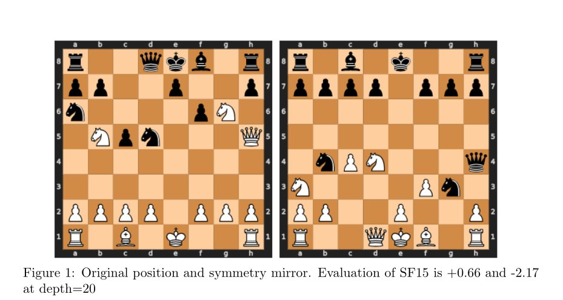

This is *not* just another blog post about chess—or at least, not only about chess. While the setting involves [Stockfish](https://stockfishchess.org/), the world's strongest open-source chess engine, the real discussion here is broader:  
How do we carefully assess inconsistencies in complex AI systems? When an AI model—or a highly optimized program—seems to violate fundamental expectations, how do we tell the difference between a genuine bug and an artifact of the evaluation setup?  
These questions brought me to the paper *Metamorphic Testing of Chess Engines* ([IST, 2023](https://www.sciencedirect.com/science/article/pii/S0950584923001179)). The authors applied **metamorphic testing (MT)**—a well-known software testing technique—to Stockfish and found numerous evaluation inconsistencies, suggesting that Stockfish might be flawed in ways that had gone unnoticed.
  
But one issue made me pause: the study was conducted at depth=10.  

Depth is *everything* in chess engine analysis. At low depths, evaluations are unstable, and discrepancies may not reflect real errors but rather artifacts of the engine's limited search horizon. **Were these reported inconsistencies actual bugs, or just fragile observations that disappeared under different conditions?**  

## Reproducibility and Beyond  

Believing in reproducibility, replicability, and variability in experiments, we took the next logical step:  

✅ We reproduced the original study and confirmed the inconsistencies at depth=10.  
✅ We extended it by testing higher depths (15, 20, and beyond).  
✅ We introduced realistic chess positions instead of synthetic ones.  
✅ We analyzed multiple versions of Stockfish to see if the issue persisted.  

What we found was fascinating—and has implications beyond chess.  

---

## A Chess Mystery: Mirrored Positions with Different Evaluations  

Take a look at this figure:  

Here, we have two mirrored chess positions. According to the metamorphic relations, they should receive identical evaluations—after all, the board is just flipped, and the game state remains the same.  

But at depth=20, Stockfish evaluates them very differently:  

📊 **Left board:** `+0.66` (slight White advantage)  
📊 **Right board:** `-2.17` (decisive Black advantage?!)  

This shouldn't happen at such a high depth. While many discrepancies at depth=10 could be dismissed, this one rings a bell.  

---

## What We Found  

After a deep dive (*pun intended*) into the Stockfish code, we uncovered a fundamental truth:  

🔹 These evaluation discrepancies are not bugs—they are a natural consequence of how chess engines explore positions.  
🔹 At low depths, these discrepancies are essentially pointless—the engine’s limited search horizon means its evaluation is far from stable or meaningful.  
🔹 Stockfish orders legal moves differently depending on board symmetry, and we found where this happens in the source code.  

This *move ordering mechanism* is one reason why metamorphic relations break down at certain depths. Small variations in the search order can lead to significant evaluation differences at low or intermediate depths. However, as depth increases, these differences tend to disappear as the search stabilizes.  

Can this be fixed?  Yes! We found where this happens in the Stockfish code. It is technically possible to *patch* the engine to enforce strict symmetry in move ordering, ensuring that mirrored positions always receive identical evaluations.  
One key takeaway? *The original study didn’t parameterize metamorphic relations by depth.*
This is a critical oversight because MRs in chess engines lose effectiveness at certain depths. Some violations at low depth are just noise.  
Another key result is that there is no impact on Stockfish despite alarming claims.

---

## A Call to Refine, Not Dismiss  

Metamorphic testing remains a powerful tool (see, e.g., some contributions and usage examples at https://blog.mathieuacher.com/WikipediaMatrixChallenge/ or https://onlinelibrary.wiley.com/doi/10.1002/stvr.1898). 
MRs could be highly effective for weaker engines, such as LLM-based chess models (see, e.g., https://blog.mathieuacher.com/GPTsChessEloRatingLegalMoves/ https://blog.mathieuacher.com/ChessWinning7MovesGPT-copy/) or traditional evaluation models that lack deep search.  

Even for Stockfish, the original study was valuable—it highlighted potential evaluation inconsistencies. Our replication doesn’t dismiss the idea of using MRs for testing chess engines—rather, it strengthens the case for *refining MRs* to account for:  

✔️ Depth sensitivity 
✔️ Move ordering variability 
✔️ Domain-specific factors  

---

## Final Thoughts  

This study blends **everything I’m passionate about**:  

♟️ Chess and AI  
📏 Reproducibility, Replicability, and Variability of Experiments  
🧪 The elegance (and pitfalls) of metamorphic testing 
🔎 The search for causal relations between software behavior and domain-specific constraints  

It also underscores the **importance of replication in science**. Had we simply taken the original study at face value, we might have walked away thinking Stockfish had a major bug. Instead, by **reproducing, replicating, analyzing deeper mechanisms, and searching for causal relations**, we found a richer, more nuanced story—one that helps refine metamorphic testing rather than discard it.  

And this lesson applies far beyond chess engines—to *AI, software engineering, and automated decision-making systems.*  

---

## Want to Dig Deeper?  

📄 **Read the full study:** [Link to paper](https://hal.science/hal-04943474v2) (Published in IST journal https://www.sciencedirect.com/science/article/pii/S0950584925000187)  
📂 **Replication materials & data:** [GitHub](https://github.com/acherm/chess-MT-Stockfish)  

Special thanks to **Fabien Libiszewski, Matthieu Cornette, Yosha Iglesias, Mathilde Choisy, Helge Spieker, Martin Monperrus, and Arnaud Gotlieb** for insightful discussions!  

**Joint work with Axel Martin, [Théo Matricon](https://theomat.github.io/), and [Djamel E. Khelladi](https://people.irisa.fr/Djamel-Eddine.Khelladi/)**  

💬 *What do you think?* Should symmetry enforcement in AI systems always be prioritized over efficiency? Have you encountered similar reproducibility challenges in software testing, software engineering, and AI? Let's discuss!  

