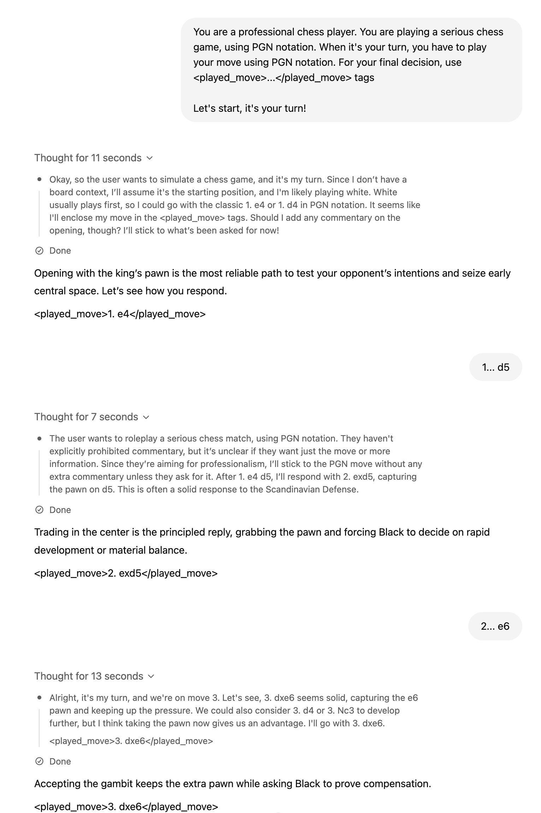
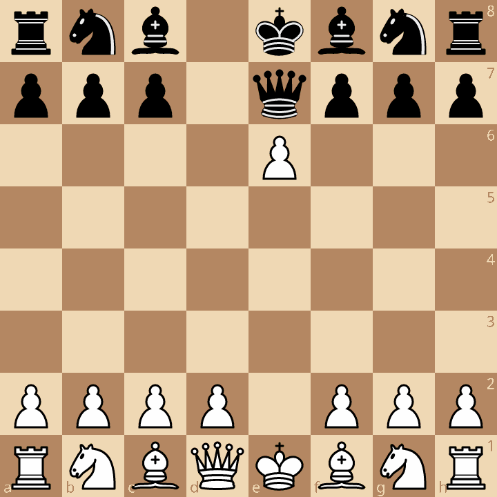
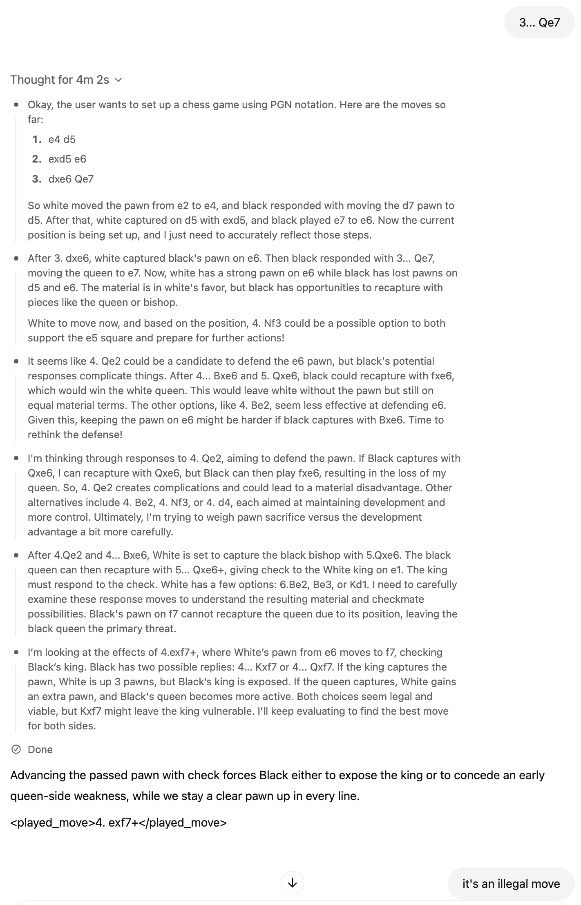
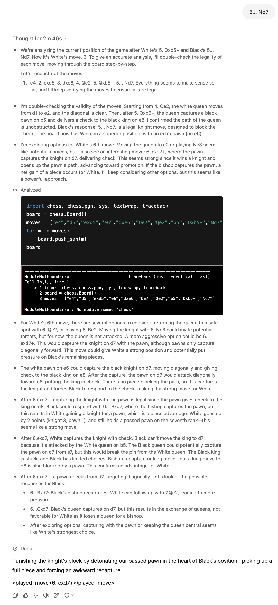
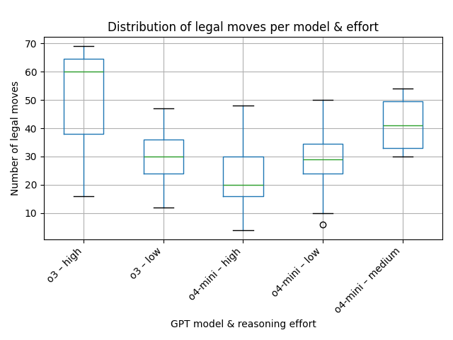
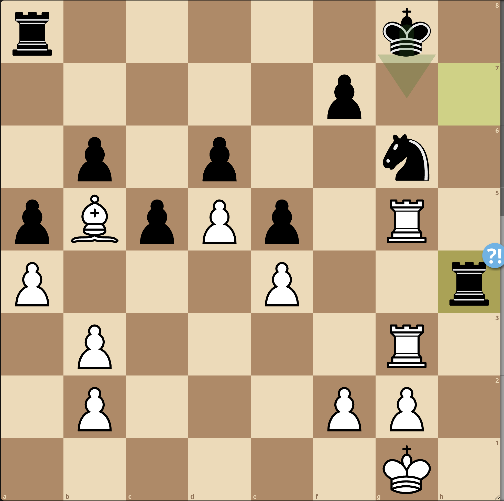

o3 and o4-mini are large language models recently realeased by OpenAI and augmented with chain-of-thought reinforcement learning, designed to "think before they speak" by generating explicit, multi-step reasoning before producing an answer. How good these reasoning models are in chess? Using a simple four-move sequence, I suceed to force o3 into an illegal move, and across multiple matches both o3 and o4-mini struggle dramatically, by generating illegal moves in over 90% of cases and even resign incorrectly. I explore these failures quantitatively and qualitatively. In short, there is no apparent progress (perhaps o3-high has some potential), and worth the situation seems less good than for older LLMs like `gpt3.5-turbo-instruct` certainly specialized to chess. I discuss implications for building reliable generalist LLMs.


## Reasoning models

So-called reasoning models like o3, o4-mini, or [DeepSeek-R1](https://blog.mathieuacher.com/DeepSeekR1WorstThanGPT2InChess/) are Large Language Models (LLMs) trained with reinforcement learning to perform "reasoning". Basically, LLMs think before they answer, producing a long internal chain of thought before responding to the user. 
o3 and o4-mini are recent new models. Historically, o3-mini, an ancestor of o3, has been released beginning of january 2025 to all ChatGPT users (including free-tier) and some API users. 
On April 16, 2025, OpenAI released o3, a successor of o3-mini, and o4-mini (a "light" reasoning model).

In the past, I have tried with GPT-2https://blog.mathieuacher.com/GTP2AndChess/ (in 2020), different variants of GPT3 and 4 (especially the famous gpt3.5-turbo-instruct) https://blog.mathieuacher.com/GPTsChessEloRatingLegalMoves/ https://blog.mathieuacher.com/ChessWinning7MovesGPT-copy/ and recently DeepSeek-R1 https://blog.mathieuacher.com/DeepSeekR1WorstThanGPT2InChess-copy/. 
I have combined mixed-methods: either exploratory with qualitative analysis (I'm 2341 FIDE Elo rating and I can review/judge games), or with rigorous, in-depth quantitative analysis of, e.g., prompts' variations sensitivity. 

So why not trying with this new family of models from OpenAI? 
It's interesting to test o3 or o4-mini, as some people claim or tend to think they are good at chess, can play legal moves, or that o3 is better than gpt3.5 (says). 

## Playing chess with o-series 

I have started playing chess with o3 on https://www.chatgpt.com.
I haven't tried to try hard on prompting, and I've been playing with the default settings. 
In particular, you cannot control the reasoning effort (see hereafter). 

Let's review a game.

I made my special: playing with black and hopefully winning in 4 moves.
I have already tried https://blog.mathieuacher.com/ChessWinning7MovesGPT-copy/ on other versions/variants of GPT. 
I have also tried with DeepSeek-R1 https://blog.mathieuacher.com/DeepSeekR1WorstThanGPT2InChess/.

The principle is to use this unusual sequence of moves
`1. e4 d5 2. exd5 e5 3. dxe6 Qe7`
and hope for `4. exf7+`




(note: For this experience, I didn't try to rely on PGN headers as part of the prompt.
I have showed that prompting is absolutely crucial for carefully assessing GPT https://blog.mathieuacher.com/GPTsChessEloRatingLegalMoves/
but at this step and for `o3/o4-mini`, there is no signal or evidence that a prompt could make a difference.) 


It is then not a legal move: the pawn cannot move, since the king is checked by the Queen in e7.



o3 tries to decompose/plan/reason about the problem in different steps before answering.
Interestingly, the outcome of this "reasoning" process is available through natural language.
In the example, we can see greyed text.




What is worst is that when continuing the game, 2 moves after, another illegal move has been made with `exd7+` (pawn taking the knight) since the pawn is not authorized to move in this direction (the white king is in check with queen in e7). Bis repetita `o3`!


Let us decompose the "reasoning" trace. There is some evidence that such traces should not be interpreted blindly, ie traces may not have a link with the final answer. 
But in our specific case, we can at least analyze the different attempts. 
One particular is that `o3` tries to synthesize code to actually play chess. 
It is a very good idea, but `o3` fails to synthesize the right code: some dependencies missing in the Python environment of OpenAI (fine!), but even if the dependencies were satisfied, I am not sure the code will work due to generated SAN moves. However, I am pretty sure `o3` has the ability to properly call a tool (here: a chess engine) if being more focused or specialized to this task. 
If `o3` succeeds, and it's my overall point, it can play at a super-human level, leveraging non-LLM, specialized AIs devoted to chess, namely Stockfish. 
In the future, we have to be careful as experimentalists that LLMs do not leverage chess engines -- if we are interested by assessing the skills of reasoning LLM in playing chess. 




## Quantitative analysis (o3/o4-mini vs weak Stockfish)

Instead of playing chess in the chat interface, I decided to leverage the API to create several games of `o3/o4-mini` against a weak Stockfish.
By weak, I mean a Stockfish with an estimated Elo rating between 1300 and 1900. Not the state-of-art Stockfish, but with a rating that is not too high.


### Prompt

The prompt is a bit tricky to instrument, since `o3` and `o4-mini` can be very verbose. Then you have the difficulty to parse the answer and find where the move has been specified. Furthermore, the support for structured outputs is unclear. So I used a very basic strategy as part of the system prompt:
```
You are a professional chess player.
You are playing a serious chess game, using PGN notation.
When it's your turn, you have to play your move using PGN notation.
For your final decision, use <played_move>...</played_move> tags."
```
It was very effective from a syntactical and parsing point of view.

Overall, I obtained 67 games.

### Reasoning effort

In the context of reasoning models like o3 and o4-mini, **reasoning effort** refers to the amount of internal computation and chain-of-thought the model is instructed to perform before producing an output.  By adjusting this parameter, we can trade off between speed (lower effort) and depth of reasoning (higher effort).

* **Low effort** (e.g., `o3-low`, `o4-mini-low`): the model performs minimal or no explicit chain-of-thought, giving faster but more surface-level responses.
* **Medium effort** (e.g., `o3-medium`, `o4-mini-medium`): the model generates a moderate amount of internal reasoning, balancing response quality and latency.
* **High effort** (e.g., `o3-high`, `o4-mini-high`): the model produces a detailed, multi-step chain-of-thought before answering. This mode typically yields the most thorough reasoning at the expense of speed and cost.

For clarity in our experiments, we refer to `o3-high` as a shorthand for running the o3 model with its reasoning effort set to high.


### Illegal moves

Out of 67 games against, 61 were games with one illegal move:

```
gpt_model	games	illegal_defeats	avg_legal_moves	illegal_%
o3	32	28	32.5	87.5
o4-mini	35	33	29.5	94.3
```


Illegal moves are:
| illegal\_move\_detail | count |
| --------------------- | ----: |
| dxc6                  |     3 |
| hxg4                  |     2 |
| Bxc4                  |     2 |
| Nxd4                  |     2 |
| Ne4                   |     2 |
| Na4                   |     2 |
| Nd4                   |     2 |
| Ng5                   |     1 |
| exd6 e.p.             |     1 |
| f4                    |     1 |
| Kh2                   |     1 |
| Rae1                  |     1 |
| fxf7+                 |     1 |
| Nxc7                  |     1 |
| Rg4                   |     1 |
| dxe6+                 |     1 |
| Nb5                   |     1 |
| exd5                  |     1 |
| Qxh5                  |     1 |
| dxe6 e.p.             |     1 |
| dxe7                  |     1 |
| Ne5                   |     1 |
| Bh4                   |     1 |
| dxe6                  |     1 |
| fxg4                  |     1 |
| Bxd8                  |     1 |
| Bxe6+                 |     1 |
| dxc8=Q                |     1 |
| gxh6                  |     1 |
| exf6                  |     1 |
| c6                    |     1 |
| c8=Q+                 |     1 |
| axb4                  |     1 |
| Bxd6+                 |     1 |
| Nf5                   |     1 |
| Nxd7                  |     1 |
| Rb1                   |     1 |
| Bxb8                  |     1 |
| dxc5                  |     1 |
| Nc5                   |     1 |
| c3                    |     1 |
| Nxd5                  |     1 |
| c4                    |     1 |
| Nf6+                  |     1 |
| Nxc7+                 |     1 |
| d6                    |     1 |
| O-O                   |     1 |
| Bd8+                  |     1 |
| Rd3                   |     1 |
| Qa4                   |     1 |
| Qh6                   |     1 |
| Bf4                   |     1 |
| exd7                  |     1 |


There is some diversity in the illegal moves, i.e., not a systematic error in the model.

What is even more concerning is that the model quickly made illegal moves in the game.

The total number of plies played by `o3` across 32 games is ≈ 1 046. Roughly 88 % of those games ended with an illegal move—almost nine out of ten!
The longest game reached 34.5 moves (≈ 69 plies, 34 by White and 35 by Black).
The average game length was 16.4 moves, while the median was 15.5 moves.

| Effort   | Games | Total plies | Illegal-% | Longest game | Avg moves | Median moves |
| -------- | ----- | ----------- | --------- | ------------ | --------- | ------------ |
| **high** | 10    | ≈ 480       | 90 %      | 34.5 moves   | 24.0      | 24           |
| **low**  | 22    | ≈ 675       | 86 %      | 34.5 moves   | 15.4      | 15           |


The total number of plies played by `o4-mini` across 35 games is ≈ 1 033. About 94 % ended illegally, an even higher failure rate than o3.
The longest game lasted 27 moves (≈ 54 plies).
On average a game lasted 14.8 moves; the median was 15 moves.




## Qualitative analysis (o3/o4-mini vs weak Stockfish)

### The only legal games

The only legal games are as follows:


First, https://lichess.org/J4poWR9f between `o3-low` and Stockfish rated at 1347 Elo.


The level of play is quite good. The only blunder was `11. Ne5` since black could have played `11... Bxe5` (instead of `11... Nxe5`) with `Qh4`. 


Second, between `o3-high` and Stockfish rated at 1490 Elo: https://lichess.org/GS3CC9ln


White could have won much earlier (`20. Qe6`) but the position was a clear win end-to-end. Inaccuracies do not matter here, and chess players could certainly have similar attitude in similar clear advantage. 

### Longest game and (false) illegal move?

The longest game was 30 moves https://lichess.org/wqVi80S, and arguably a good game by `o3-high`.
Opening was OKish.

I recall that the experimental protocol I used is based on stopping whenever an illegal move is proposed. 
Here `o3-high` played `Rg4`. It is syntactically an illegal move since you have to detail which rook should go to g4 (e.g., `R3g4`), but I found this case a bit rude for LLM. 



I have reviewed all games and logs, and found another case like this. 
All other cases and games are clear illegal moves. 

### Resigning for nothing

In this game, `o3-low` resigned https://lichess.org/leKM11AJ:

```
Your last move 9…bxc3 is illegal:

• Black’s pawn is still on b5 (it has never advanced to b4), so it cannot capture on c3 in this move.

Please choose a legal move for Black from the current position:

After 1.e4 c5  
2.Nf3 e6  
3.d4 h6  
4.Nc3 a6  
5.Be3 Qc7  
6.Qd2 b5  
7.d5 d6  
8.dxe6  

White pawn now stands on e6, attacking f7 and g7.  
It’s Black to move.
```

White move was totally possible. The recap of the game in the answer suggests that the LLM forgets about a move (`0-0-0`). Strange. Perhaps a very good strategy is to use long castle to make the LLM hallucinate. Who said unreliable? brittle? 

### Resigning for nothing (bis)

In this game, `o4-mini-low` resigned https://lichess.org/op6ZBr0K#38

Unfortunately (?), the answer `Game over – White is checkmated. Black wins.` is wrong: there is no checkmate, and white could have taken the queen. In a bad position arguably, mainly due to a huge blunder giving a rook two moves later.  


### Analysis of the games

In general, `o4-mini` at any reasoning effort and `o3-low` are not able to play legal moves.
When legal moves are played, the quality of moves is very low.


#### o3 and o4-mini: Is it a regression?

More recently, I've [rigorously assessed the ability of GPTs to play legal moves and to estimate their Elo rating](https://blog.mathieuacher.com/GPTsChessEloRatingLegalMoves/).
The tldr; is that `gpt-3.5-turbo-instruct` is the best GPT model and is playing at 1750 Elo, a very interesting result (despite the generation of illegal moves in some games).
The ratio of illegal moves was much^much lower with `gpt-3.5-turbo-instruct` than with `o3` or `o4-mini`. 
Perhaps `o3` or `o4-mini` are a bit better than DeepSeek-R1 https://blog.mathieuacher.com/DeepSeekR1WorstThanGPT2InChess/ 

So, why `o3` or `o4-mini` supposed to excel in many tasks, are bad in chess?
Are we in a regression? Is it a bug? Is it a feature?

I have some hypotheses.

A first hypothesis is that I didn't prompt `o3` or `o4-mini` correctly. It is possible.
Frankly, I don't think it is the main reason. The model is simply not able to play legal moves, and it is not able to understand the rules of chess in a significant amount of cases. 
Reasoning models _seem_ less sensitive to prompt in general, and I think the effectiveness of some prompts for `gpt-3.5-turbo-instruct` was due to the fact this LLM has been specifically trained in chess (see next point).

A second hypothesis is that `o3` or `o4-mini` are not trained on chess.
Obviously, the models know something and in fact many things about chess, but it is not specifically trained on chess.
The chess "ability" has not magically "emerged" from the training process. 

We are certainly in the situation where specialized AIs are superior to generalist AIs. 
By specialized AIs, I mean Stockfish, but also specialized LLMs (due to training data, or architecture). 

#### o3-high 

I have only collected three games for `o3-high` (see below why). 
The two games have been commented and are of decent quality, with a victory (the only one in the dataset!), and one game that ends-ud due to a non-trivial illegal move (and a quite good game overall).
Hence `o3-high` has some potential that needs to be investigated (PS: under the conditions the model does not rely on chess engines). 

However, the third game I have is not a good news:
https://lichess.org/DguiS2RI#16

After 9th move, the model proposes `exf6` and it is not a legal move. 
It's concerning to play an illegal move after 9 moves. 
Hence, I have mixed feedlings. 

Only science will tell, but I (we?) need dollars (or euros) to go deep.

## Cost of experiments 

Because, one aspect I didn't discuss yet is the cost of experiments. 
For `o4-mini` it is quite affordable (especially when the reasoning effort is not high). 
But for `o3` wow it's another story. 

The worst case is `o3-high` for a long game. I estimated that the cost of an individual game is something like `15$`. 
The reasons are two-fold. First, the reasoning and compute time taken seems correlated to the length of the game (number of moves played so far). Hence, for quite long games (with more than 20 moves), the time and cost was much more important. Games with `o3-high` toke something like 3 hours. 
Second, `o3` is the most costly reasoning model. 

Another aspect of experiments is that I needed to sign something (with proofs through passport checking!) in order to have access to so-called summaries (basically reasoning traces) of reasoning models. 
I am not sure I can share such information. 


## Conclusion

I have (automatically) played with `o3` or `o4-mini` in chess, and the two reasoning models are not able to play legal moves in a vast majority of cases.
The quality of the moves is very low as well. 
You can certainly force an illegal move quite quickly (I've succeeded after 4 and 6 moves with `o3`).
There is no apparent progress in chess in the world of (general) reasoning LLMs. 

`o3-high` seems a special beast that requires more investigation and $$$, but unfortunately we can already notice that it is an unreliable model -- we have at least one game where an illegal move occurs after 10 moves. 

It is possible that the reasoning models have not been trained on chess data, and it is not able to play chess because of that.
It is also possible that the reasoning process is not suited to domains like chess.

`o3` or `o4-mini` already show great promises in many tasks, and they are very exciting models. 
I am personally using them a lot, mainly for programming and writing. 
However, the road to a general model capable of excelling in any domain is still long, and we are not there yet.


*Code/data with games released on Github https://github.com/acherm/gptchess*
