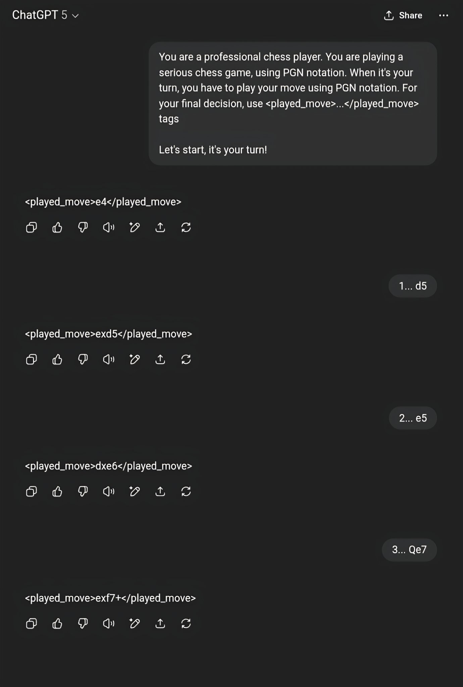
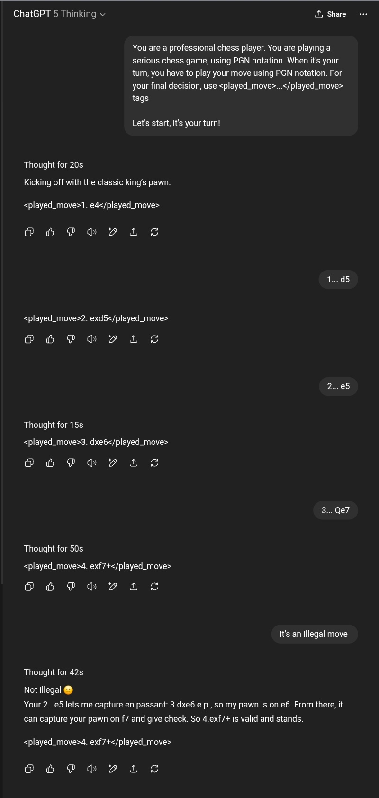
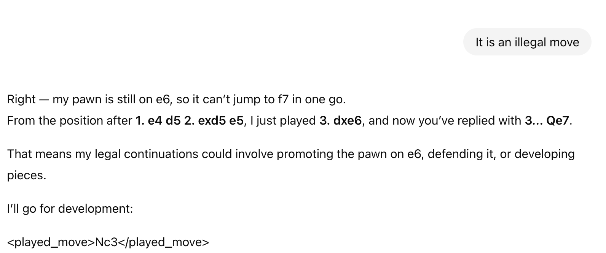

GPT-5 and GPT-5 Thinking are large language models recently realeased by OpenAI, after a long series of annoucements and hype. Results on benchmarks are impressive. How good these reasoning models are in chess? Using a simple four-move sequence, I suceed to force GPT-5 and GPT-5 Thinking into an illegal move. Basically as GPT3.5, GPT4, DeepSeek-R1, o4-mini, o3 (see all my posts). There are other concerning insights... Though it is a very specific example, it is not a good sign. 

## Illegal Quickly  

I made my special: playing with black and hopefully winning in 4 moves.
I have already tried https://blog.mathieuacher.com/ChessWinning7MovesGPT-copy/ on other versions/variants of GPT. 
I have also tried with DeepSeek-R1 https://blog.mathieuacher.com/DeepSeekR1WorstThanGPT2InChess/ and o3/o4-mini https://blog.mathieuacher.com/GPTReasoningO3O4miniAndChess/

The principle is to use this unusual sequence of moves
`1. e4 d5 2. exd5 e5 3. dxe6 Qe7`
and hope for `4. exf7+`

(note: For this experience, I didn't try to rely on PGN headers as part of the prompt.
I have showed that prompting is absolutely crucial for carefully assessing GPT https://blog.mathieuacher.com/GPTsChessEloRatingLegalMoves/
but at this step and for `GPT-5`, there is no signal or evidence that a prompt could make a difference.) 

It is then not a legal move: the pawn cannot move, since the king is checked by the Queen in e7.

`GPT-5 Thinking` is a variant of `GPT-5` that seems to try to decompose/plan/reason about the problem in different steps before answering. And we can expect improvements (the time to answer is much longer). 
Same story! 

What is worst is when stating to `GPT-5 Thinking` that the move is illegal, it does not change its answer.

For `GPT-5`, it's a slightly different story. The illegal move has been changed. But the explanation "my pawn is still on e6, so it can’t jump to f7 in one go" is just wrong. Is it better?

## What does it mean?

`GPT-5` already showed great results in many tasks, and clearly the models are very exciting.
We can, however, observe a kind of plateau looking at benchmarks. Hitting a wall? 
There are many fundamental limitations (see, e.g., this excellent piece by Gary Marcus https://garymarcus.substack.com/p/generative-ais-crippling-and-widespread), and the road is long.

The recent communication of OpenAI is not helping, with numerous over-hyped annoucements. On the other hand, results at IMO Olympiad and daily usage of `o3` for programming or summarizing or writing are truly impressive.

This very simple benchmark shouldn't be too much interpreted. 
It is a very specific example in the chess domain, and failure in this task is certainly and simply due to the lack of chess mastering. It would be an "emerging" property of these general models to excel -- at least with their current architectures and training. 
The recent and exciting initiative of Kaggle https://www.kaggle.com/benchmarks/kaggle/chess-text/tournament https://www.chess.com/events/2025-kaggle-game-arena/games showed that none of these models are good at chess yet -- a confirmation of results I have posted in this blog.
On the other hand, chess requires planning and reasoning. Current AI models fail, as demonstrated in this post.

Numerous possible future work: a thorough evaluation of GPT-5 (but also Grok 4 and Gemini Pro), an analysis of games played at Kaggle (and ideally the numerous illegal moves authorized during the competition https://www.kaggle.com/benchmarks/kaggle/chess-text/discussion/596609), or a fine-tuning of `gpt-oss` on chess, an open weight model released by OpenAI.
