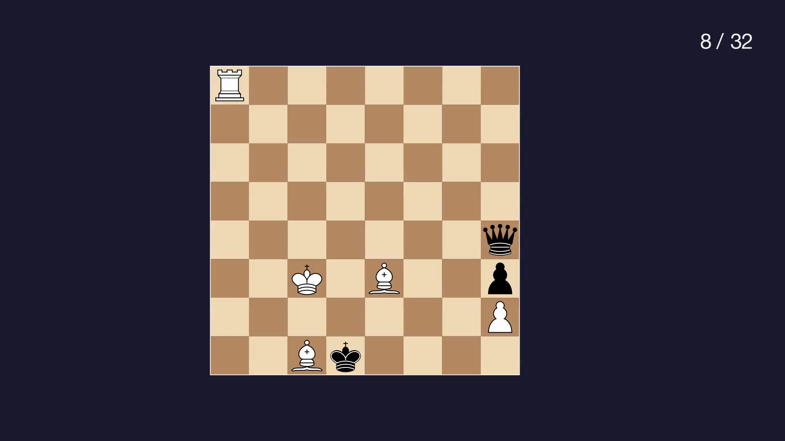
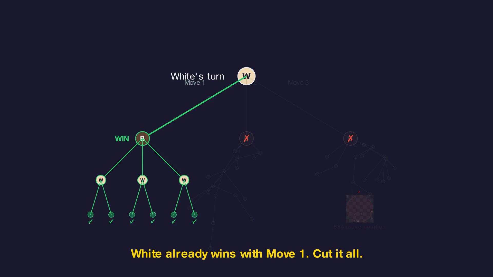
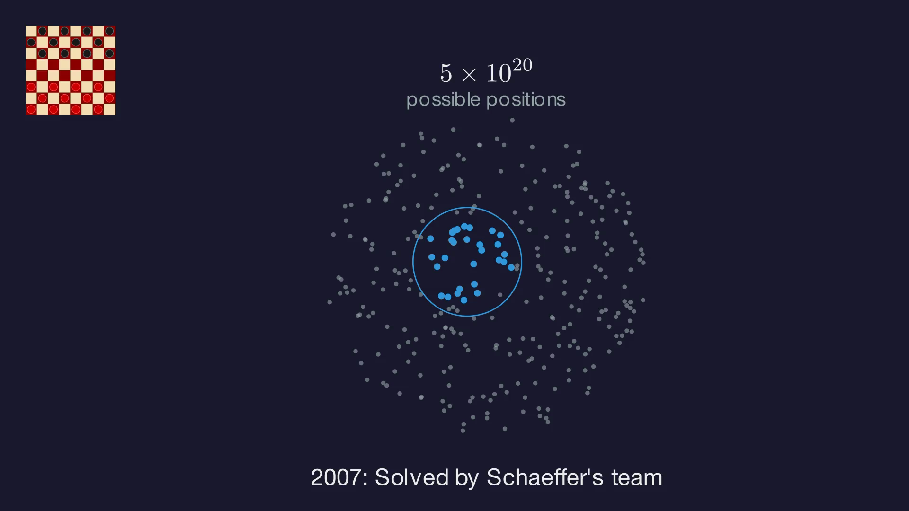
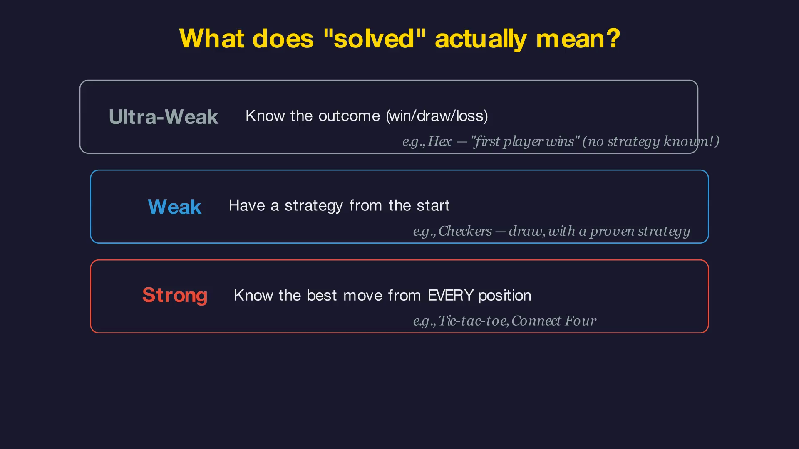
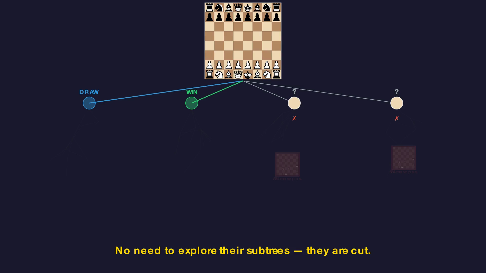

Garry Kasparov recently [tweeted](https://x.com/Kasparov63/status/2022016470826545287) about a chess endgame with just 8 pieces that requires 584 perfect moves to win. His conclusion: chess will never be solved, and even if it were, the results would be "practically meaningless." I think this reasoning has a subtle but important flaw. I made a short animated video and slides to explain why.

<iframe width="560" height="315" src="https://www.youtube.com/embed/TODO" title="YouTube video player" frameborder="0" allow="accelerometer; autoplay; clipboard-write; encrypted-media; gyroscope; picture-in-picture; web-share" allowfullscreen></iframe>

(slides available [here as PDF](TODO) and [here as Reveal.js](TODO))

## The 584-Move Position Is Real

Let's be clear: the position is crazy complex. 8 pieces on the board (out of the original 32), White to move, and the only path to victory takes 584 precise moves. One mistake and the win evaporates. This is not a toy example: it comes from recently released endgame tablebases, the gold standard of chess computation.

Kasparov's quote in full:

> "584 moves with just 8 of 32 pieces on the board! Further evidence that not only will chess never be solved, but that should such miraculous technology ever appear, the results will be practically meaningless for human players."

The implicit argument is: if a tiny corner of chess with 8 pieces is already that complex, the full game with 32 pieces must be astronomically harder. Therefore, solving chess is hopeless.

It sounds compelling. But it conflates two very different things.

## You Don't Need to Explore Every Position

The chess game tree has roughly 10^44 legal positions. The 584-move endgame is buried somewhere deep inside it. But does a solution to chess -- a proof of whether the game is a win or a draw from the starting position -- need to *visit* that position?

Not necessarily.

Think of it like route planning. You want to get from A to B. You find a verified route: A → D → E → B. Done. There might be incredibly complex road networks elsewhere on the map -- dead ends, loops, one-way labyrinths. But they are irrelevant to *your* route.

Game trees work the same way. When it's your turn, you only need *one* good move (an OR node). When it's your opponent's turn, you must handle *all* their responses (an AND node). But once a branch is decided (say, it leads to a win) you can cut everything else. The 584-move position might sit deep in a subtree that gets pruned entirely, because an earlier branch was already won.

This is not a theoretical curiosity. It's exactly how games get solved in practice.

## Checkers: The Precedent

In 2007, Jonathan Schaeffer and his team [proved that checkers is a draw](https://www.science.org/doi/10.1126/science.1144079). Checkers has about 5 × 10^20 possible positions. The proof needed only a tiny fraction of them. The vast majority of the state space was irrelevant -- the solution never had to visit it.

Could chess work the same way? The state space is incomparably larger, of course. But the *principle* holds: you don't need a complete map of every position. You need one robust strategy that works from the starting position, covering every possible opponent response along the way.

## The Hidden Assumption: Strong vs. Weak Solving

There is a key distinction in game theory that Kasparov's argument glosses over. There are (at least) three levels of "solving" a game:

- **Ultra-weak**: know the outcome (win, draw, or loss) without knowing the strategy. Example: Hex -- first player wins, but no efficient strategy is known.
- **Weak**: have a complete strategy from the starting position. Example: checkers.
- **Strong**: know the best move from *every* legal position, including unreachable ones. Example: tic-tac-toe.

When Kasparov says "chess will never be solved," he seems to assume *strong* solving -- mapping every position, including the 584-move monster. And yes, that might well be infeasible.

But weak solving is arguably what matters. We want to know: is chess a win or a draw from the starting position? And can we prove it with a strategy? For that, we only need positions reachable under perfect play. The 584-move endgame, spectacular as it is, may simply never arise when both sides play optimally. A monster in a cave that the winning path never enters.

## The Nuance: What Weak Solving Doesn't Give You

To be fair, weak solving has a real limitation. If, say, 1.e4 turns out to be winning, a weak solution would prove that. But it would tell us nothing about 1.d4 or 1.c4. You get *one* optimal line, not the full picture. To learn the truth about other moves, you'd have to redo the work. It is something that weak solving cannot provide in the first place, but we can envision to consider 1. d4 and applies the same logic. 
I am a 1. e4 proponent, so the best subjective scenario for me is that chess is a win for White and 1. d4 is a draw. 
That would be incredible.

Getting back to earth, the most probable outcome is that chess is a draw (most experts believe so, and I am part of that group). In a draw proof, the solution must cover *all* of White's first moves. Black needs to show survival against each one. That's more work, but also more complete.

And here's the punchline: even in a draw proof that covers all 20 first moves, the 584-move position can still be irrelevant. Covering 1.d4 or 1. c4 or 1. Nf3 or ... doesn't mean you'll wander into some exotic 8-piece endgame that only arises from a bizarre sequence of moves.

Weak solving gives you the verdict. Not the full map. That's a trade-off, not a flaw.

## So, Is Kasparov Right?

Kasparov is right that chess contains astonishing depth. The 584-move position is a demonstration of combinatorial complexity. Nobody disputes that.

But he is wrong to conclude that this depth *proves* chess is unsolvable. The existence of hard positions in remote corners of the game tree does not imply that a solution must traverse those corners. Depth in the caves doesn't block the path above.

We don't know yet whether chess is a win or a draw. The problem remains extraordinarily hard. But the 584-move argument doesn't close the door. It's like saying "this cave system is incredibly deep" and concluding "therefore you can't walk across the surface." These are different problems.

There is reason for hope.

## Going further

I made a ~5-minute animated video with [Manim](https://www.manim.community/) (the engine behind 3Blue1Brown's videos) to walk through this argument visually: the 584-position, game trees, pruning, the checkers precedent, and the three levels of solving. The [slides are also available as PDF and as a Reveal.js presentation](TODO).

The video, the slides, and this blog post were produced with the help of [Claude Code](https://claude.ai/code) and GPT 5.2 Pro for the conceptual discussions. [Manim](https://www.manim.community/) is a fantastic tool for this kind of thing -- you describe scenes in Python and it renders publication-quality animations. Highly recommended for anyone wanting to explain visual or mathematical ideas.

Let me know what you think!
